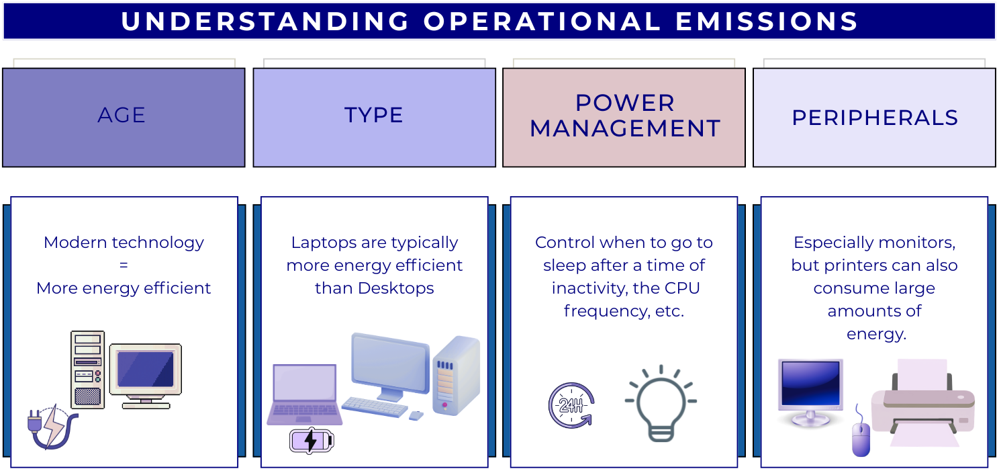
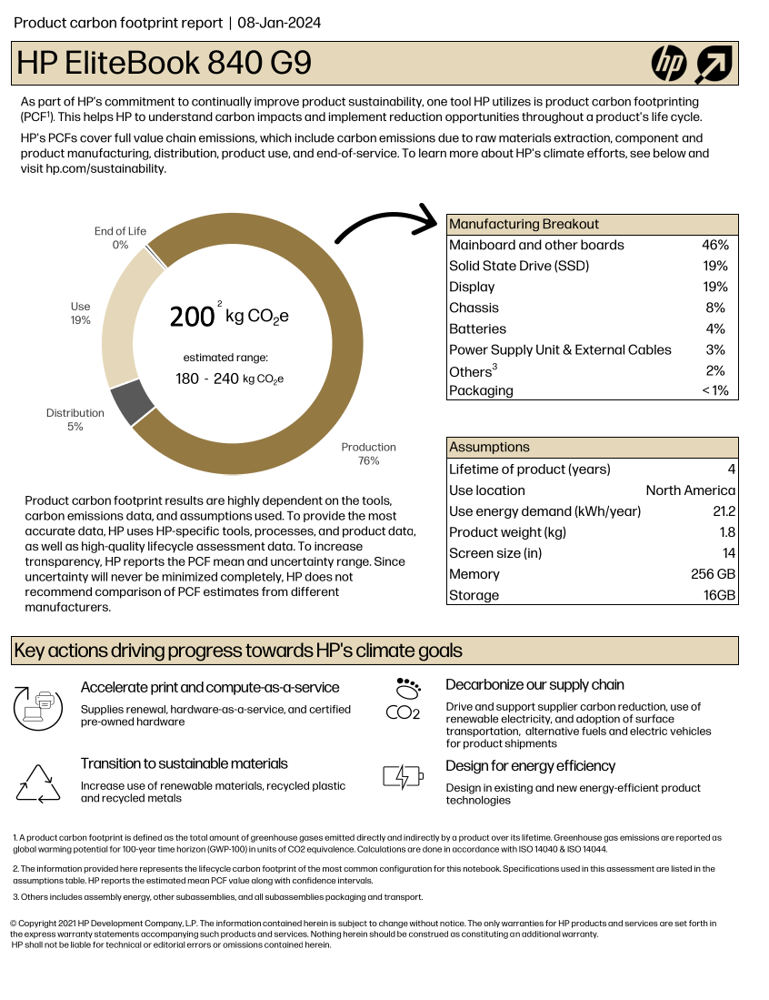
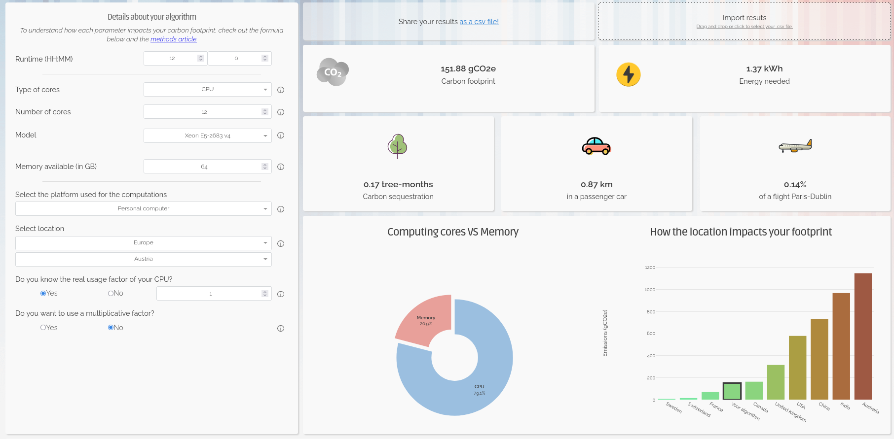
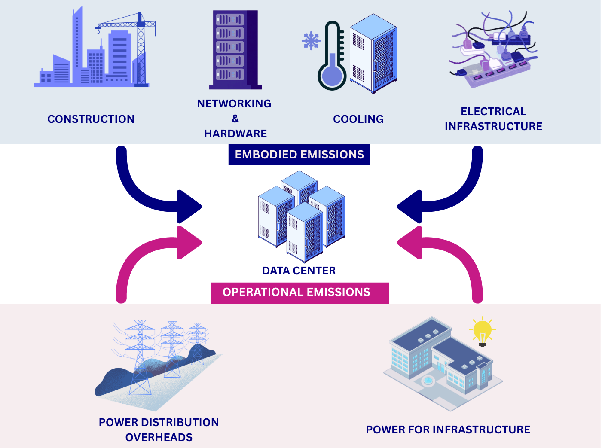

:::::::::::::::::::::::::::::::::::::: questions

- What are the main sources of carbon emissions from computers, storage devices, and
  data centres?
- How do embodied and operational emissions compare for different types of hardware and
  storage technologies?
- What factors influence whether data centre computing is more or less carbon intensive
  than local computing?
- How can research data management practices and computational services contribute to
  carbon emissions?

::::::::::::::::::::::::::::::::::::::::::::::::

::::::::::::::::::::::::::::::::::::: objectives

- Analyze the trade-offs between embodied and operational emissions for different
  computing and storage technologies.
- Calculate carbon emissions from personal devices and research workflows using
  appropriate tools.
- Evaluate the carbon efficiency of different research infrastructure choices, including
  local versus cloud computing and various storage strategies.
- Identify strategies to reduce emissions from research activities, including code
  optimization, data management plans, and carbon-aware computing.

::::::::::::::::::::::::::::::::::::::::::::::::

## Digital Research Infrastructure

Modern digital research depends on infrastructure ranging from individual computers and
devices up to the globe spanning network of the internet. In this section we'll look at
some of the different components of digital infrastructure and their relation to carbon
emissions.

{alt='Person thinking on different aspects of digital
infrastructure that produce carbon emissions, showing computers, storage devices, data
centres and the research activity itself.'}

## Computers

{alt="An
image of a laptop with it's constituent components spilling out underneath and "}

Computers draw electricity during use and also produce considerable embodied emissions
from production and transportation. Both embodied and operational emissions play a
significant role in the carbon footprint of computing devices, but how to estimate them
and reduce them is very different.

### Embodied emissions

Embodied carbon emissions **do not change** once the machine is in your hands: they only
depend on the manufacturing and transport process. However, **embodied carbon emissions
per year** are reduced the more years the machine is in use. Hence, **the longer the
lifetime of the machine, the lower their embodied carbon footprint per year**.

::::::::::::::::::::::::::::::::::::: callout

Before replacing a computer, make sure that it is really needed and that it is no longer
fit for purpose.

- Can you replace just some parts to extend its lifetime, eg. memory, GPUs?
- Can you give it another useful purpose?
- Can you donate it to charity (eg. see options in the [Device Donation Scheme]) to
  extend its useful life instead of trashing it (or recycling it)?

{alt="A depiction of the lifecycle of a laptop from
its manufacture, transportation, usage, refurbishment and reusage."}

:::::::::::::::::::::::::::::::::::::::::::::

### Operational emissions

The operational emissions of a device depend on its design and performance, but also on
_how_, _when_ and _where_ it is used. For this reason, it is useful to consider
energy usage as a proxy for carbon emissions.

The power consumption of digital devices can be split into:

- **idle consumption**: this accounts for the energy required when the device is powered
but not carrying out any particular operation.

- **usage-based consumption**: the energy consumed to perform a specific task. As
  computational workload increases, components like CPUs and GPUs, and memory draw
  higher levels of power, which may require energy systems to work harder to cool the
  system.

<!-- markdownlint-disable-next-line line-length -->
{alt='Factors that affect operational emissions including age, type, power management settings and peripherals.'}

:::::::::::::::::::::::::: callout

### Utilisation, Utilisation, Utilisation

Following from the above, sustainability in computing means having **the minimum amount
of hardware, fully utilised doing useful work**. This ensures the "fixed" overheads of
idle power and embodied emissions are minimised per unit of useful computational work.

::::::::::::::::::::::::::::::::::

:::::::::::::::::::::::::: callout

### Operational vs Embedded Emissions

As a rule of thumb, for consumer electronic devices (that is laptops, desktops, tablets
and phones) the embodied emissions are far in excess of operational ones. This
emphasises the importance of maximising the lifetime of these devices.

For enterprise servers that have a much greater maximum operational power draw, the
balance can vary with factors like local carbon intensity and utilisation. As the carbon
intensity of electricity is expected to fall over time however, embodied emissions will
increasingly dominate.

::::::::::::::::::::::::::::::::::

### Estimating and Measuring Computer Emissions

#### Embodied Emissions

Finding the embodied emissions of a device relies on information provided by the
manufacturer. The regulatory environment is evolving; however, increasingly, there are
legal requirements for manufacturers to publish Product Carbon Footprint (PCF) data for
their products. Information can be easily found by searching the internet for "PCF" and
the manufacturer's name.

::::::::::::::::::::: callout

We'll see some example PCF sheets below. However, it's important to note that different
manufacturers can use different methodologies and assumptions. This means it is not
advised to directly compare PCF data between manufacturers.

:::::::::::::::::::::::::::::

Here is the [HP EliteBook 840 G9 PCF Report]:

<!-- markdownlint-disable-next-line line-length -->
{alt='Product Carbon Footprint report for HP EliteBook 840 G9.'}

[HP EliteBook 840 G9 PCF Report]: https://h20195.www2.hp.com/v2/GetDocument.aspx?docname=c08207991

If we exclude the `Use` section of the chart, the remaining, related to production and
transportation, accounts for about ~80% of the estimated total, i.e. 160 kgCO₂e.

::::::::::::::::::::::::::::::::::::: challenge

#### What are the embodied carbon emissions of your computer?

Find the model of the computer you are using right now to do this course and try to find
out its embodied carbon emissions.

- Which part produces a larger carbon footprint?
- If it is a laptop and the battery is failing, how much carbon could you save if you
  just replace the battery for a new one instead of replacing the whole laptop?

:::::::::::::::::::::::::::::::::::::::::::::::

#### Operational Emissions

<!-- markdownlint-disable-next-line line-length -->
{alt='Ways to
calculate carbon emissions.'}

Power draw can be measured via:

- **Plug-in power meter.** There are many models, but most will provide both the
  instantaneous power and the energy used over a period of time. The obvious requirement
  however is physical access to the power source.
- **Hardware counters.** Modern hardware often supports reporting the power usage of
  individual components. This varies based on the hardware but two common examples are
  RAPL (Running Average Power Limit) for CPUs and `nvidia-smi` NVIDIA GPUs.
- **[CodeCarbon]**. A Python application providing a more user friendly interface for
  hardware counters.

If it is impractical to make any direct measurements, there are also some methods to
estimate power draw:

- **[ECO Declaration].** Provides manufacturer information about idle power usage. For
  example, the [ECO declaration of the HP EliteBook 840 G9] indicates an idle energy
  consumption of 22.67 kWh/year. This declaration also includes useful information about
  the product, like which components can be replaced or upgrade. The ECO Declaration is
  a voluntary standard so not all manufacturers provide it or it may contain incomplete
  information.
- **[Green Algorithms Calculator].** A simple model that combines information about the
  resource utilisation of a computational workload with details of the hardware it ran
  on.

<!-- markdownlint-disable-next-line line-length -->
{alt="A screenshot of the Green Algorithms Calculator webpage showing an example calculation and the result carbon emissions."}

::::::::::::::::::::::::::::::::::::: challenge

#### Trying Out the Green Algorithms Calculator

Open the [Green Algorithms Calculator] and try to calculate the energy usage and carbon
emissions of your computer running a task on 1 CPU-core for 12 hours.

:::::::::::::::::::::::::::::::::::::::::::::::

[Device Donation Scheme]: https://www.london.gov.uk/coronavirus/volunteer-and-donate/device-donation-scheme
[ECO Declaration]: https://ecma-international.org/publications-and-standards/standards/ecma-370/
[ECO declaration of the HP EliteBook 840 G9]: https://h20195.www2.hp.com/v2/GetDocument.aspx?docname=c08155359&search=HP%20EliteBook%20840%20G9
[Codecarbon]: https://github.com/mlco2/codecarbon
[Green Algorithms Calculator]: https://calculator.green-algorithms.org/

## Storage Devices

Research datasets are increasingly large and replicated across multiple systems for
reliability. As modern research practices move toward open data and long-term storage,
the embodied and operational emissions of storage becomes a significant component of
digital research's environmental impact.

There are a few different storage mediums in common use:

- **Solid-State Disk Drives (SSD)**: They use flash memory with no moving parts to store
  data, much like SD cards and USB drives, but with much larger capacity. Their embodied
  carbon emissions are high due to the rare metals needed for semiconductor manufacturing,
  while operational emissions are somewhat lower than for spinning disks.
- **Hard Disk Drives (HDD)**: They store data on spinning magnetic disks. Embodied
  emissions are lower than those of SSDs but operational emissions are higher because
  their disks must spin continuously.
- **Linear Tape-Open (LTO Tape)**: Magnetic tape technology used for long-term storage.
  Their embodied emissions are low, while their operational emissions are near
  zero.

### Measuring and Estimating Data Storage Emissions

Similarly to computers, their associated carbon emissions can be split into operational
and embedded components. Storage devices are often components of larger systems which
can make it difficult to directly measure their power usage. Whilst some manufacturers
do report sustainability data this is highly variable. In some cases storage device data
may be included as a component of the PCF data for a complete system.

Given the general paucity of data, there have been some studies that attempt to estimate
emissions from different storage media. We've summarised some useful estimates below:

| Category | SSD | HDD | LTO tape |
| :--- | :--- | :--- | :--- |
| **Embodied Carbon** | High (16-32 kg)^1^ | Moderate (2-4 kg)^1^ | Low (~0.07 kg)^3^ |
| **Operational Carbon** | Low (2-5 kg)^1^ | Moderate - High (2-16 kg)^1,2^ | Low (~0 kg) |
| **Lifespan** | 5–10 years | 5-10 years | 30+ years |

\* Emissions are in **kgCO₂e per TB per year**

While the numbers vary depending on manufacturers and reporting available, it is generally
considered that SSDs have a higher carbon debt per unit of storage than HDDs^4^.
However, recent data suggests that the difference for enterprise-grade drives is shrinking,
and new SSDs have only 2x the embodied carbon of comparable HDDs^5^.

SSDs allow data to be accessed almost instantly and are typically 10–100× faster than
HDDs. LTO tapes offer the slowest access speeds, but they remain the preferred option
for storing cold data due to their low cost, low embodied emissions and great energy
efficiency.

## Data Centres

Beyond personal computing devices like laptops and PC's, much computing infrastructure
is now accessed remotely. In this case, the computers are generally hosted in a data
centre, a large industrial facility that can contain thousands of servers and the
supporting infrastructure required to allow remote access.

The carbon emissions associated with the computers and storage devices in a data centre
are covered above. As purpose built facilities, data centres can host more specialised
equipment and benefit from economies of scale. They also have additional emissions
sources beyond the individual servers they house.

<!-- markdownlint-disable-next-line line-length -->
{alt='Sources of embodied and operational
carbon emissions for data centers'}

Data centre embodied emissions:

- **data-centre construction**: includes the concrete, steel, electrical infrastructure,
  etc.
- **networking and supporting hardware**: as the servers in a data centre are accessed
  remotely they must be serviced by network infrastructure such as switches and cables.
- **cooling**: the density of compute in data centres means they must have dedicated
  infrastructure for cooling. More information on this topic, in particular the water
  usage, is discussed below.
- **electrical infrastructure**: the high power demands of data centres
  can require construction of additional electrical infrastructure in the local area to
  support connection to the grid.

There are additional sources of operational emissions as well:

- **power for infrastructure**: this includes the networking infrastructure,
  cooling systems, lighting, etc.
- **power distribution overheads**: data centers deal with large amounts of electrical
  and encounter overheads in its distribution and transformation.

The energy efficiency of data centres is usually measured as their **Power Usage
Effectiveness (PUE)**, and determines how much of the energy entering the data centre
reaches the IT equipment used for servers and storage compared to the energy used for
other purposes like cooling.

$$
\mathbf{PUE} = \frac{\text{Total Facility Power}}{\text{IT Equipment Power}}
$$

{alt="The
image shows 15 kW of electrical power being transferred to a data center. The 15 kW is
then divided with 5 kW going to Overheads/Cooling/etc and 10 kW going to servers. This
gives a PUE of 1.5."}

An average data centre has a PUE of around 1.59, meaning that for every 1 watt used to
power computational resources, an additional 0.59 watts is spent on cooling and power
distribution. Newer and larger data centres tend to be more efficient^11^, with a global
average PUE of 1.41 in 2025^11^.

The operational emissions of data centers depends heavily on the grid carbon intensity,
with lower emissions in renewable-powered regions and higher emissions in
fossil-fuel-dominated regions.

Despite the additional emissions sources, data centres have the ability to be far more
energy efficient than the equivalent collection of individual computers or storage
devices. This is due to their scale and specialisation and the provision of
infrastructure that can be shared between many users.

| Category | Data Center | Local Equipment |
| :--- | :--- | :--- |
| **Embodied Carbon** | Lower (shared + efficient infrastructure) | Higher (duplication + under‑used hardware) |
| **Operational Carbon** | Usually lower (efficient cooling) | Usually higher (older facilities + local grid) |
| **Energy Efficiency** | High (fewer idle disks) | Generally lower |
| **Utilisation** | High (resources shared across many users) | Lower (over‑provisioning) |

### Data centres and water usage

While this course focuses on the carbon emissions via the electricity usage, there is
another big environmental factor associated to the running of data centres: water.

Water in data centres is used in huge amounts for cooling purposes. [Recent studies]
suggest that medium-size data centres consume more than 1 million litres of water per
day, while for large data centres, this number jumps to about 23 million litres per day,
equivalent to the daily usage of about 50,000 households in the US.

While not as commonly available as the Power Usage Effectiveness (PUE), some data
centres provide a [Water Usage Effectiveness (WUE)] that measures how much water is used
per kWh of energy used. The ideal cases is 0 l/kWh, where no water at all is used, but
most common values are around 1.9 l/kWh.

::::::::::::::::::::::::::::::: callout

### Use of water in data centres

Except in cooler locations where natural or air-only cooling ("free cooling") can be
enough to extract all the heat generated during computation from the data centres, in
most cases, some level of water-based cooling is required. There are two broad methods
for water-cooled data centres:

- **Using air cooling with water evaporation in chillers**. This is an open-loop method
where water is lost into the atmosphere - hence removing it from the reservoir it was
taken from, and therefore wasteful - but it is technically simpler to implement.
- **Via direct liquid cooling**, where the coolant (not necessarily water) is directly in
contact with the processing unit. [Direct-to-chip liquid cooling and immersive liquid cooling]
are two server liquid cooling technologies that dissipate heat while significantly
reducing water consumption, but at a much higher cost and technical complexity.

:::::::::::::::::::::::::::::::::::::::

[Recent studies]: https://www.eesi.org/articles/view/data-centers-and-water-consumption
[Direct-to-chip liquid cooling and immersive liquid cooling]: https://www.datacenterdynamics.com/en/analysis/an-introduction-to-liquid-cooling-in-the-data-center/
[Water Usage Effectiveness (WUE)]: https://www.datacenterknowledge.com/cooling/a-guide-to-data-center-water-usage-effectiveness-wue-and-best-practices

::::::::::::::::::::::::::::: callout

## Data Centres and The Cloud

The "cloud" is the delivery model for computing services over the internet. Cloud
services are implemented and run on physical data centres owned and operated by cloud
providers. Because cloud providers benefit from the advantages of data centre hosting,
cloud deployments are often more energy and carbon efficient than many small scale
on‑premise setups - but the cloud's actual footprint still depends on the provider's
hardware, PUE, electricity grid mix and redundancy/replication practices.

:::::::::::::::::::::::::::::::::::::

::::::::::::::::::::::::::::::::::::: instructor

Depending on the size of the group and their engagement, the following challenge can also
be done collectively as a class:

- Participants go in turns suggesting items, and the instructor writes them in a whiteboard
- Participants write items in post-its and then stick them on a wall

Both options can be done for remote delivery of the course, using digital whiteboards.
Finally, the instructor comments on the results.

:::::::::::::::::::::::::::::::::::::::::::::::::

::::::::::::::::::::::::::::::::::::: challenge

## What do you use data centres for?

There are way more things that we initially may think that make use of data centres, some
related to digital research but plenty of others that do not.

In small groups, reflect and discuss which daily activities in your everyday life make
use of data centres, sorting them into digital research, other work-related activities,
and personal activities.

- Where do you have more items?
- Which category do you think consume more data centre power?
- After talking to your colleagues, did anything surprise you about what uses data centres?

:::::::::::::::: solution

Each group is likely to have a different list, but some of the items that are likely
to be present in most of them are:

- Digital research
    - Store some code in GitHub, Codeberg or other platform
    - Run continuous integration workflows
    - Run software - including AI training - in cloud services
    - Store large amounts of research data with a cloud provider
- Other work related activities
    - Send emails
    - Meet colleagues via Teams or Zoom
    - Store some office documents in Onedrive, Dropbox or similar
- Personal activities
    - Use instant message apps with family and friends
    - Send personal emails
    - Stream music or films
    - Check social media
    - Order food
    - Buy items in online shops
    - Read online newspapers, blogposts or similar
    - Check the weather forecast
    - Check Google Maps or other similar applications
    - Review your bank account
    - ...

As you see, a lot of our daily activities go through a data centre somewhere
and while digital research will make heavy use of these facilities because they are
intensive workflows, the sheer amount of other small tasks can easily offset the carbon
emissions of the former when considered collectively.

:::::::::::::::::::::::::

:::::::::::::::::::::::::::::::::::::::::::::::

### Data Centre Expansion, Hyperscalers and AI

Increasingly, data centres are appearing in the media in a negative light due to their
power and water consumption. Data centres consume around 2.5% of the UK's electricity
and the annual consumption is expected to increase by 4 times by 2030^8^. In the U.S.,
data centres are predicted to use up to 12% of the country's electricity by 2028, a 3x
increase from 4.4% in 2025^9^.

Much of this expansion is driven by a relatively small number of tech companies. The
compute demands of training and serving AI models is also driving a noticeable increase.
In the UK the Department of Science Innovation and Technology have projected a need for
6GW of AI ready data centre capacity by 2030^13^ compared to overall current national
demand of ~30-35 GW.

Additionally there have been reports of tech companies obscuring and under-reporting the
emissions associated with data centres. This [Guardian
article][guardian-data-centre-emissions] for instance covers how, the industry
frequently tries to obscure its true carbon footprint in a number of ways. One such way
is the use of renewable energy certificates (Recs), where a data centre company can make
itself appear to purchase some percentage of its energy from renewable sources, despite
that energy not reaching the facility. The companies frequently report 'market-based'
emissions, which are manipulated by the inclusion of Recs, but look out for the
'location-based' emissions figure for a less misleading view of their carbon footprint.

[guardian-data-centre-emissions]: https://www.theguardian.com/technology/2024/sep/15/data-center-gas-emissions-tech

### Measuring and Estimating Cloud Emissions

If you're making use of resources housed in a data centre you are unlikely to be able to
directly measure device or component level power consumption. In many cases when
consuming cloud based resources you may not even know what hardware is being used. In
this case you're heavily dependent of information provided by the service operator or
third party estimates. Particularly in the case of cloud providers this can become
highly complex with many factors at play.

Some cloud providers do provide tooling for making exposing sustainability information.
For example [AWS Sustainability Console], [Google Carbon Footprint] and the [Microsoft
Emissions Impact Dashboard].

[Google Carbon Footprint]: https://cloud.google.com/carbon-footprint?hl=en
[AWS Sustainability Console]: https://aws.amazon.com/sustainability/tools/console/
[Microsoft Emissions Impact Dashboard]:https://www.microsoft.com/en-us/sustainability/emissions-impact-dashboard

## Research Activities

### Simulation, Modelling and Data Analysis

The primary infrastructure required to carry out these activities is access to
computation. This can be provided by a laptop, desktop or a server hosted in a data
centre.

::::::::::::::::::::::::::: challenge

## Minimizing emissions from computation

What are relevant considerations that can help to minimise the emissions associated with
computational workloads?

::::::::::::::::::::::: solution

- **Embodied and operational emissions** are both key contributors. Optimally, a given
  amount of compute should be provided by the minimum associated embodied emissions.
  It's therefore key to maximise utilisation of hardware rather than investing in more.
  This strongly promotes using computational computational services based on shared
  infrastructure (such as cloud or high performance computing facilities) where
  utilisation can be kept high and operational emissions are greatly reduced compared to
  individual desktops or laptops.
- **Computational Architectures** have become increasingly diverse in recent years both
  for CPUs and for accelerators (e.g. GPUs). Computational problems can have very
  different electricity consumption depending on the architecture used so choosing the
  right one can be very impactful.
- **Doing less computation** is also worth considering. This can take the form of
  planning computational workloads carefully to minimise resource usage or limiting work
  carried out for speculative or exploratory purposes.
- **Code optimisation** is the art of minimising the computational resources required to
  solve a given problem. This can take various forms depending on programming language
  and computational architecture but impressive speed ups can be obtained in some cases
  compared with unoptimised code.
- **Carbon awareness** is making your use of digital resources responsive to changes in
  carbon intensity of electricity generation. This can take different forms, for example,
  moving use to locations which have lower carbon intensities, changing the time at which
  you consume electricity to periods with lower carbon intensities or even making your
  workload intensity responsive to carbon intensity forecasts to minimise operational
  emissions.

::::::::::::::::::::::::::::::::

::::::::::::::::::::::::::::::::::::

### Research Data Management

#### Storing Data

Shared storage services can often be more sustainable than dedicated storage
hardware because they can have higher resource utilisation and benefit from
economies of scale. However, the relative sustainability of each approach
depends on factors such as utilisation, hardware efficiency, and the source
of electricity used to power the infrastructure. Local storage has several advantages,
including greater control over data, predictable access speeds, and the ability to power
equipment down when not in use. Typically, research organisations will provide
dedicated storage services for research data.

::::::::::::::::::::::::::: challenge

### Minimizing emissions from data storage

What are relevant considerations that can help to minimise the emissions associated with
data storage?

::::::::::::::::::::::: solution

- Delete unused or redundant data and avoid unnecessary replication.
- Keep frequently accessed data on faster storage (SSDs) and move "cold"
  or infrequently accessed data to slower but more energy efficient systems (tape
  storage)^12^.
- Use compression and efficient file formats to reduce storage requirements
- Consider cleaning and preprocessing data locally before storing.
- Choose storage options designed for infrequent access when appropriate.

:::::::::::::::::::::::::::::::::

::::::::::::::::::::::::::::::::::::::

::::::::::::::::::::::::::: callout

#### Data Management Plans

**The best time to think about how to manage you data is before you collect or generate
it.** This is the purpose of a Data Management Plan (DMP), a document that describes how
you will handle your data during and after a research project. DMPs are often required
by funding agencies and research institutions, but they are also a good practice to
ensure that your data is well organised, documented and preserved.

In addition to being a good scientific practice, DMPs can also help you to reduce
the carbon footprint of your data. Tracking and monitoring your data in this manner
can help you to identify (and where possible, avoid) unnecessary data collection and
storage. This will in turn help you to make informed decisions about your data
management practices and making them more sustainable.

The UK Data Service provides a [data management planning overview](https://ukdataservice.ac.uk/learning-hub/research-data-management/plan-to-share/data-management-planning-overview/)
and a [checklist](https://ukdataservice.ac.uk/learning-hub/research-data-management/plan-to-share/checklist/)
of key points to consider when creating a DMP.

:::::::::::::::::::::::::::::::::::

### Use of Computational Services

Rather than directly using a computer, many digital research activities are provided by
accessing services over the internet. Ultimately these services are provided by physical
infrastructure however, as an end user, it can be very difficult to know how your
activity corresponds to resource consumption. In these cases we usually have to depend
on information from the service provider or make relative comparisons through proxy
metrics.

It's not possible to comprehensively cover the services used in modern digital research
so below we've chosen a few exemplars to look at in detail.

#### Code Hosting and Continuous Integration/Deployment

The use of services such as GitHub and GitLab have become an indispensable component of
modern software development. Notably, these services provide access to compute resources
to run Continuous Integration/Deployment (CI/CD) workflows. It's common to run these
workflows in a "matrix" configuration across variables, such as operating system and
software version, which can lead to large parallel computational workloads executing.

CI/CD workflows are executed by servers acting as runners. Most services provide hosted
runners for general use and support self-hosting a runner if you provide your own
server. The latter case is amenable to the measurement and estimation methods discussed
above. If using runners hosted by the service, however, you usually will have no control
or visibility over where workflows are executed or the underlying hardware they use.
Direct measurement of energy usage in this case is not possible, and there is
insufficient information to use approaches like the Green Algorithms Calculator. Instead,
[Eco CI] is a tool that has been developed to estimate the carbon emissions of CI/CD
workflows. It supports GitHub and GitLab.

[Eco CI]: https://github.com/green-coding-solutions/eco-ci-energy-estimation

To reduce emissions from CI/CD usage consider ways to reduce the number of workflow
executions whilst maintaining strong quality assurance checks. Some strategies are
explored in this [poster][evironmentally-aware-github-actions] from the Imperial
Research Software Engineering team.

[evironmentally-aware-github-actions]: https://doi.org/10.5281/zenodo.12754189

#### Generative AI

Increasingly, generative AI services are used to generate text, images and computer code
with consequent diverse applications in digital research. Emissions associated with
generative AI models can be split into two components:

- **Training** is carried out as a one-off process before you even interact with a model.
  These are all of the resources required to gather training data, design the
  architecture and parameterise model weights.
- **Inference** occurs whenever you interact with a model, typically by providing a
  prompt. This refers to the energy required to transmit your prompt, generate the
  response and transmit it back to you.

There are some important factors to bear in mind when interacting with LLMs that drive
emissions:

- **Model size**: Larger models typically require more energy to run.
- **Query count**: The more queries you make to a model, the more energy it will
consume. Hence, being mindful of the number of interactions and trying to batch queries
when possible can help reduce emissions comparatively.
- **Response token count**: The length of the response generated by the model can also
impact energy usage, as longer responses require more computation. Reducing the length of
the response by being more specific in your prompt might help.

A useful tool to estimate the environmental impact of AI usage is [EcoLogits]. It's
available as a Python package or an online version is [hosted by
HuggingFace][huggingface-ecologits]. It is currently limited to text generation with
Large Language Models and only covers the inference stage. Whilst it supports as many
open LLMs as possible it only has data for a limited number of proprietary LLMs where
information is available about the model architecture.

[EcoLogits]: https://ecologits.ai
[huggingface-ecologits]: https://huggingface.co/spaces/genai-impact/ecologits-calculator

### References

1. [Swamit Tannu and Prashant J. Nair. 2023. The Dirty Secret of SSDs: Embodied Carbon. SIGENERGY Energy Inform. Rev. 3, 3 (October 2023), 4–9](https://dl.acm.org/doi/10.1145/3630614.3630616)
2. [Based on Seagate EXOS X18](https://www.seagate.com/content/dam/seagate/assets/esg/planet/product-sustainability/images/exos-x18-sustainability-report/files/Exos-X18-18TB-Sustainability-Report-2023.pdf)
3. [Based on LTO 9 - FUJIFILM. _Sustainability Report 2020_. 2020](https://www.fujifilm.com/files-holdings/en/sustainability/report/2020/sustainability_activity_report_2020_ff_sr_2020_all_a4_E.pdf)
4. [Rteil, N., Kenny, R., Andrews, D., & Kerwin, K. (2025). Understanding the carbon footprint of storage media: A critical review of embodied emissions in hard disk drives. International Journal of Environmental and Ecological Engineering, 19(11), 263–270](https://researchportal.lsbu.ac.uk/ws/portalfiles/portal/15145533/understanding-the-carbon-footprint-of-storage-media-a-critical-review-of-embodied-emissions-in-hard-disk-drives_1_.pdf)
5. [How Do the Embodied Carbon Dioxide Equivalents of Flash Compare to HDDs?](https://blog.purestorage.com/perspectives/how-do-the-embodied-carbon-dioxide-equivalents-of-flash-compare-to-hdds-part-1/#:~:text=Instead%20of%20an%208x%20difference,continue%20well%20into%20the%20future.)
6. [Digital Decarbonisation - CO₂e Data Calculator](https://digitaldecarb.org/co2-data-calculator/)
7. [WholeGrain DIgital Report](https://www.wholegraindigital.com/digitaldeclutter/#cloud-storage)
8. [National Energy System Operator](https://www.neso.energy/document/346791/download)
9. [U.S. Department of Energy - 2024 Report on U.S. Data Center Energy Use](https://escholarship.org/uc/item/32d6m0d1)
10. [Uptime Institute, Large data centres are mostly more efficient, analysis confirms, 7 February 2024](https://journal.uptimeinstitute.com/large-data-centres-are-mostly-more-efficient-analysis-confirms/)
11. [IEA, Energy and AI, April 2025, p259](https://www.iea.org/reports/energy-and-ai)
12. [Sustainable computing in science - EMBL-EBI](https://www.ebi.ac.uk/training/online/courses/sustainable-computing-in-science/what-can-we-do/good-practices-in-data-management/)
13. [Data centres: planning policy, sustainability and resilience](https://researchbriefings.files.parliament.uk/documents/CBP-10315/CBP-10315.pdf)

::::::::::::::::::::::::::::::::::::: keypoints

- For consumer devices, embodied emissions typically outweigh operational emissions,
  making extending device lifetime the most impactful sustainability action for personal
  computing hardware.
- Data centres are generally more carbon efficient than equivalent local computing
  setups due to higher utilisation, better cooling efficiency, and shared infrastructure.
- Choice of storage technology significantly affects carbon emissions; LTO tape is
  preferable for cold or archival data, while SSDs suit frequently accessed data.
- Research data management practices — such as deleting unused data, using compression,
  and adopting tiered storage — can substantially reduce storage-related emissions.
- Generative AI emissions scale with model size, query count, and response length;
  selecting the smallest model appropriate to the task reduces unnecessary emissions.
- Carbon-aware computing — shifting workloads in time or location to periods or regions
  with lower carbon intensity — is an effective strategy for reducing operational
  emissions from computational workloads.

::::::::::::::::::::::::::::::::::::::::::::::::
