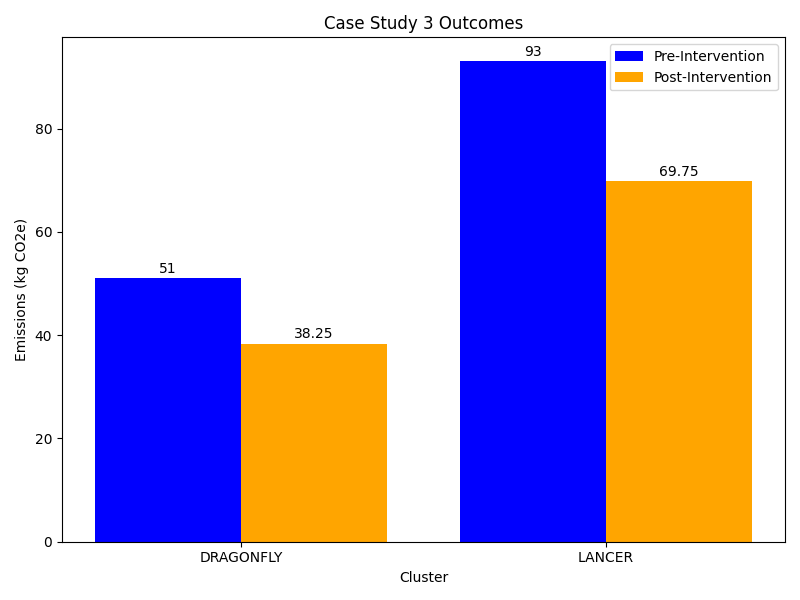

:::::::::::::::::::::::::::::::::::::: questions

- What are the sustainability considerations related to High Performance Computing?

::::::::::::::::::::::::::::::::::::::::::::::::

::::::::::::::::::::::::::::::::::::: objectives

- Introduce a representative research case study relating to High Peformance Computing.
- Explore ways to measure and estimate carbon emissions from High Performance Computing
  clusters.
- Explore ways to reduce the carbon emissions associated with a given workload.

::::::::::::::::::::::::::::::::::::::::::::::::

## Introduction

Hugh is a computational chemist in a research group whose work involves high fidelity
simulations of the dynamic behaviour of atomistic systems. His work requires
computational resources far beyond that of a single machine so he makes use of a number
of High Performance Computing facilities.

Hugh is working on several different research questions that requires the use of
different simulation softwares. Choice of which software to use is usually driven by
existing research data and the capabilities of different codes. Whilst he often makes
use of software that has been pre-installed by system administrators, he sometimes has
to compile packages himself.

In addition to simulation work, Hugh carries out data analysis and creates
visualisations.

Hugh has access to 2 different HPC facilities he can make use of:

- a general purpose institutional cluster offering a mix of CPUs.
- a cluster providing targeted support for the atomistic simulation community.

Both facilities are heavily subscribed and Hugh tries to maximise his throughput at all
times. Workloads on these clusters are submitted to a queue and will start running at an
unknown time. Almost all of his workloads run for at least 48 hours.

## Collecting Information

Hugh starts by doing some background reasearch about the two clusters he uses.

DRAGONFLY is a cluster based in London. It doesn't publish any sustainability
information. The documentation pages provide some lists of the available hardware but
these are fairly high level and don't include specific CPU or server models.

LANCER is a cluster based in Wales. Its documentation has some dedicated information on
sustainability including a GHG analysis of the cluster. This includes an embodied
emissions analysis as well as total power usage. Most usefully Hugh finds that the
cluster provides a tool for users to estimate the carbon emissions of their workloads.
This tool has been tested and calibrated for the cluster so should be fairly accurate.

Hugh then considers each of the emissions sources in turn.

### Electricity usage from HPC workloads

Hugh realises that carbon emissions associated with his HPC usage are directly related
to his level of usage. Currently Hugh is fairly sure he uses LANCER the most but he
doesn't track exactly how much and what workloads he runs. Collecting this data will be
an important first step.

Even without detailed data Hugh is confident that his simulation workloads form more
than 90% of his cluster usage. As the data analysis workflows also tend to be more
diverse he decides to focus his initial efforts on his simulation workloads as he will
get the most impact from improving those.

Hugh also notes that most of his simulation workloads run for at least 48 hours and he
has no control over when they start running. He therefore concludes that there is little
scope to exploit demand shifting to reduce carbon intensity.

### Embodied Emissions from HPC facilities

Whilst the embodied emissions for the clusters are relevant to calculating the carbon
impact of his work, Hugh notes that these are a sunk cost that he is unable to impact at
this point. LANCER provides some data but DRAGONFLY doesn't provide nearly enough
information to make much headway. Hugh emails the admins of DRAGONFLY but they're unable
to provide him with more information. Based on this Hugh decides not to consider
embodied emissions in his analysis.

## Analysis

::::::::::::::::::::::::::::::: instructor

Delivery of the rest of this material is intended to go in two phases:

1. Attendees are expected to complete the "Estimating Emissions" challenge. This is best
   done in groups. After the group task, attendees can report back on what they've come
   up with.

1. Then attendees can open the spoiler tag - "Hugh's estimates". This section provides
   the "canonical" outcome of Hugh's emissions estimates and further develops the
   scenario so that reductions in emissions can be considered. It is recommended that
   the groups from above look through the section together and complete the embedded
   challenge.

::::::::::::::::::::::::::::::::::::::::::

:::::::::::::::::::::::::::::::::: challenge

### Estimating Emissions

Based on the scenario described above how could Hugh estimate the carbon emissions
associated with his HPC workloads over a year? What additional data would he need to
collect?

::::::::::::::::::::::::::::::: solution

Hugh needs two things.

1. An estimate of his resource usage over a year. It may be possible to reconstruct this
   from historical data or he may have to monitor his usage for a period of time and
   then extrapolate to annual usage from there. To simplify this he can focus on only
   his main simulation campaigns and exclude any data analysis workloads. Key data he'll
   want to track includes CPU-hours and Gb-hours of memory usage.
1. A method to estimate emissions from his usage. For LANCER this is straightforward
   using the tooling that's supplied for the cluster. Making an estimate for DRAGONFLY
   is harder without equivalent tooling. There are several options. Hugh could attempt
   to use a model like the [Green Algorithms Calculator] if he has sufficient
   information about the hardware used by DRAGONFLY. A simpler alternative would be to
   assume that emissions for a given set of resources are the same between DRAGONFLY and
   LANCER then extrapolate from LANCER emissions estimates to get equivalents for
   DRAGONFLY. In both cases the estimate for DRAGONFLY is likely to be much more
   approximate but is still useful to have.

[Green Algorithms Calculator]: https://calculator.green-algorithms.org/

::::::::::::::::::::::::::::::::::::::::

::::::::::::::::::::::::::::::::::::::::::::

:::::::::::::::::::::::::::::::::::: spoiler

## Hugh's Estimates

For the next two weeks Hugh keeps track of the workloads that he runs on the different
clusters. He tracks the total CPU-hours spent on different clusters and the different
simulation codes used on each one. He also gets the total estimated emissions for LANCER
using the provided cluster tooling.

| Cluster | Simulation Code | Total CPU-hours | Notes | Emissions (kgCO₂e) |
| --- | --- | ---: | --- | --- |
| DRAGONFLY | GROMINZ | 45,000 | Self-compiled | |
| | ORANGE | 30,000 | | |
| | LUMMPS | 20,000 | | |
| LANCER | GROMINZ | 60,000 | Self-compiled | 32 |
| | ORANGE | 40,000 | | 21 |
| | LUMMPS | 75,000 | | 40 |

The total estimated emissions are 94 kgCO₂e from the two week period. Hugh also decides
to estimate his emissions from DRAGONFLY by scaling the emissions of LANCER by the
difference in CPU-hours used on both systems - he's aware that LANCER and DRAGONFLY are
quite different and so this value for DRAGONFLY is very approximate.

:::::::::::::::::::::::::::::::::: challenge

## Estimating DRAGONFLY emissions

Based on the above approach, estimate the emissions from DRAGONFLY for each of the
simulation codes.

:::::::::::::::::::::::::::::: solution

Taking GROMINZ as an example:

$$
Emissions_{DRAGONFLY} = \frac{Resources_{DRAGONFLY}}{Resources_{LANCER}} *
Emissions_{LANCER} \\
Emissions_{DRAGONFLY} = \frac{45000 CPUhours}{60000 CPUhours} * 32 kgCO_2e \\
Emissions_{DRAGONFLY} = 24 kgCO_2e
$$

Applying this to the other simulation codes gives:

| Cluster | Simulation Code | Total CPU-hours | Notes | Emissions (kgCO₂e) |
| --- | --- | ---: | --- | --- |
| DRAGONFLY | GROMINZ | 45,000 | Self-compiled | 24 |
| | ORANGE | 30,000 | | 16 |
| | LUMMPS | 20,000 | | 11 |
| LANCER | GROMINZ | 60,000 | Self-compiled | 32 |
| | ORANGE | 40,000 | | 21 |
| | LUMMPS | 75,000 | | 40 |

This gives a total 144 kgCO₂e from the two week period.

:::::::::::::::::::::::::::::::::::::::

::::::::::::::::::::::::::::::::::::::::::::

Whilst collecting the above data Hugh also notes that around 15,000 CPU-hours were wasted
on workloads that he hadn't setup properly and which had to be repeated. He estimates
this corresponds to around 8 kgCO₂e.

To better understand what this figure means Hugh, takes his total emissions figure from
the two weeks and compares it with other emissions sources. He finds that 144 kgCO₂e is
approximately equivalent to driving for around 500 miles in a petrol fueled car^1^.

Scaling the number for two weeks up to a full year, Hugh gets a total of 3.5 TCO₂e. He
notes that this is close to the UK per-capita emissions for energy generation. This
means the electricity demands of his work is nearly equivalent to those of whole second
person.

::::::::::::::::::::::::::::::::::::::::::::

## Taking Action

:::::::::::::::::::::::::::::::::: instructor

Similarly to above, the below challenge can be tackled collectively and attendees can
report back on their results.

The following spoiler section then rounds out the scenario and provides a "canonical"
outcome. Suggest that the below "outcomes" section is delivered to all attendees.

:::::::::::::::::::::::::::::::::::::::::::::

:::::::::::::::::::::::::::::::::: challenge

## Planning Action

Based on the outcome of Hugh's data collection and analysis consider the following:

- Where would Hugh derive the most impact to reduce emissions?
- What steps could Hugh take to reduce the emissions associated with his work? These
  might be technical or changes to his work practices.

:::::::::::::::::::::::::::::: solution

For focussing his future actions and exploration:

- Hugh spends the most CPU-hours on LANCER.
- Hugh spends the most CPU-hours using GROMINZ.

The 15,000 wasted CPU-hours are also a good focus as the associated emmisions were
non-productive.

There are many steps Hugh could take to reduce emissions. Keep a record of the ideas
you've had and compare them with those in the next section.

:::::::::::::::::::::::::::::::::::::::

::::::::::::::::::::::::::::::::::::::::::::

::::::::::::::::::::::::::::::::::: spoiler

### Hugh Takes Action

Based on the data gathered above Hugh observes:

- He spends the most CPU-hours on LANCER.
- He spends the most CPU-hours using GROMINZ.

This suggests Hugh will get the most impact by focussing his efforts on these areas.
Hugh wants to be able to measure the impact of any changes he makes which can be best
done using the emissions tooling on LANCER. He's also confident that most changes he
makes on LANCER will be transferable to DRAGONFLY even if he can't measure the impact so
directly there.

In order to minimise his emissions Hugh realises he can both improve the efficiency of
the simulations he performs and try to reduce the overall amount of simulation.

### Reducing Simulation

The 15,000 wasted CPU-hours of simulation are an obvious initial target. Hugh reviews
the jobs that went wrong and identifies the root causes. He then adjusts his workflows
to prevent them happening again. To help in the future, he agrees with a member of his
research group that they will double check each others simulation inputs before starting
significant new simulation projects. With these measures Hugh estimates that he may be
able to reduce his wasted CPU-hours by half.

Hugh's work requires running simulations for many individual timesteps but it's often
not obvious in advance how many timesteps are required. Reviewing some of his recent
projects Hugh concludes that by monitoring his workloads more closely he can terminate
some of them earlier. Hugh estimates this could reduce the CPU-hours used per project by
10%.

### Optimising Workloads

Hugh notes that GROMINZ is less commonly used in his field and so he has had to compile
it himself on both clusters. Hugh doesn't have a lot of experience doing this and had to
piece together how to do it with some online searching and notes from a old colleague.
Hugh reaches out to the authors of the code who are able to give him some general advice
but can't offer tailored help. Hugh also gets in touch with the local Research Software
Engineering team at his institute who are more familiar with the clusters and are able
to provide a small amount of effort to help. Together they identify some tweaks to the
compilation and manage to get a 5% speed boost.

To better understand the differences between the codes and clusters he uses Hugh carries
out some performance benchmarking. He runs simulations with all of his simulation codes
across both clusters. Hugh carefully designs these simulations to be short, so as to not
generate too many emissions, but representative of typical workloads. A key finding he
identifies is that GROMINZ runs 15% faster on LANCER when using the same number of CPU
cores. Meanwhile, ORANGE and LUMMPS don't show much difference between the two clusters.
Hugh realises he can work more efficiently by shifting as much of his work using GROMINZ
to LANCER as possible.

Most of Hugh's simulations require him to run jobs in parallel, using many CPU cores and
cluster nodes at the same time. Hugh is familiar with the fact that as his jobs use
increasing amount of resources there is a trade-off in computational efficiency. With
some of his current projects Hugh realises he has not put much thought into choosing the
resources used. Taking one of his recent projects Hugh carries out some benchmarking by
running the same simulation using different sets of computational resources. He
identifies that for that set of simulations he could have reduced his use of
computational resources by 20% whilst only losing 10% speed. Hugh resolves to carry out
this sort of benchmarking for all new projects he starts to identify a good trade-off
between speed and efficiency.

::::::::::::::::::::::::::::::::::::::::::::

## Outcomes

<!-- markdownlint-disable-next-line line-length -->
{alt='A bar chart comparing the emissions from DRAGONFLY and LANCER before and after implementation of emissions reduction measures'}

Putting all of the above steps together Hugh estimates that he can reduce his overall
use of CPU-hours by 25% across both clusters. This would result in a saving of ~36 kgCO2
from his two week data collection period. Expanding this over a full year gives a
reduction of nearly 936 kgCO2. Hugh also continues to collect data on his HPC workloads
so that he can assess the impact of the changes he's made in the future.

Hugh shares his findings with his colleagues in their regular group meeting. Several of
his colleagues use the same clusters and simulation codes as him so they are easily able
to make use of Hugh's work.

Hugh also contacts the team maintaining DRAGONFLY highlighting the utility of tools to
measure carbon intensity data. The team promises to explore how they can add some more
functionality to DRAGONFLY.

## References

1. Calculated from an emissions rate of 0.27849 kgCO₂e/mile. This is emissions rate
   reported for an average car in 2025 by the [UK Government Conversion Factors for
   greenhouse gases
   dataset](https://www.gov.uk/government/publications/greenhouse-gas-reporting-conversion-factors-2025).
