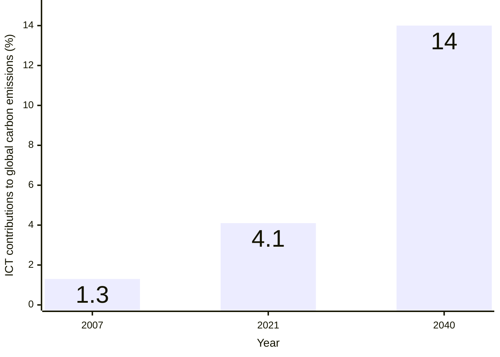

:::::::::::::::::::::::::::::::::::::: questions

- What are the net zero goals and why are they important for addressing climate change?
- How does digital research contribute to greenhouse gas emissions, and what is the
  scale of this contribution?
- What is mindful computing and how can it be applied to reduce carbon emissions in
  research?
- Why is it important for researchers to consider the environmental impact of their
  digital activities?

::::::::::::::::::::::::::::::::::::::::::::::::

::::::::::::::::::::::::::::::::::::: objectives

- Explain the context of net zero goals and the distinction between carbon neutral and
  net zero.
- Identify the main contributors to carbon emissions in digital research infrastructure.
- Describe the concept of mindful computing and its relevance to sustainable research
  practices.
- Justify why researchers have a responsibility to minimize carbon emissions from their
  digital activities.

::::::::::::::::::::::::::::::::::::::::::::::::

## Environmental sustainability

Environmental sustainability refers to the need for human activity to be balanced with
the long term health of the planet and availability of natural resources. There are many
issues that can impact environmental sustainability:

<!-- markdownlint-disable-next-line line-length -->
{alt="Picture showing some challenges of environmental sustainability, including greenhouse gas emissions, potable water usage, waste and pollution, and loss of biodiversity, among others"}

The most pressing sustainability challenge facing the world is the emission of
greenhouse gases driving the climate emergency. For this reason we will primarily focus
on greenhouse gas emissions, in particular we'll focus on the metric Kilograms Carbon
Dioxide Equivalent (kgCO₂e). This is a simplified metric that aims to represent the
impact of a range of greenhouse gases as a single figure by expressing them as an
equivalent emitted quantity of Carbon Dioxide (CO₂).

## The context of net zero goals

[Climate change and global warming](https://weather.metoffice.gov.uk/climate-change/effects-of-climate-change)
have become pressing issues in recent years. A primary cause of these phenomena is the
increase in greenhouse gas emissions in the atmosphere. Greenhouse gases (for example,
carbon dioxide) are responsible for trapping heat in the Earth's
atmosphere, leading to rising global temperatures. These gases are emitted from various
human activities, including the burning of fossil fuels, deforestation, and industrial
processes.

To combat this, many countries, including the UK have set "[net
zero](https://netzeroclimate.org/what-is-net-zero-2/)" goals.
Net zero refers to the balance between the amount of greenhouse gases emitted
and the amount removed from the atmosphere. The way to achieve net zero is by
reducing emissions as much as possible and decarbonising activities. The [UK
plans to reach net
zero](https://commonslibrary.parliament.uk/research-briefings/cbp-9888/) by 2050.

::::::::::::::::::::::::: callout

### Carbon neutral vs net zero

The terms **carbon neutral** and **net zero** are often used interchangeably, but they have
different meanings. They both refer to removing harmful emissions from the atmosphere,
but the kind of emissions removed and the scale are different.

- **Carbon neutral** requires taking action to reduce carbon emissions and offsetting
any remaining emissions, of a given activity. Offsetting is the process of compensating
for carbon emissions by investing in projects that reduce or remove an equivalent
amount of carbon from the atmosphere, such as planting trees or investing in renewable
energy projects. Usually organisations would first begin by reducing their carbon
emissions as much as possible, and then offset the remaining emissions. For example,
monitoring the [carbon intensity](https://www.nationalgrid.com/stories/energy-explained/what-is-carbon-intensity)
of the electricity being used can help identify the best times to use energy, and hence
reduce the carbon emissions.

- **Net zero** refers to the balance between the amount of "all" the [greenhouse gases](https://www.nationalgrid.com/stories/energy-explained/what-are-greenhouse-gases)
(like carbon dioxide, methane or sulphur dioxide) emitted and the amount removed
from the atmosphere. Hence, achieving net zero has a much wider scope and requires going
further than just reducing carbon emissions.

:::::::::::::::::::::::::::::::::

::::::::::::::::::::::::::::::::::::: instructor

To make the audience reflect a little bit before diving into the content, run a
poll with the following questions:

- What do you think the main contributors are to the emissions of digital research?
  Multiple choice or open question, depending on how close we want answers to be. If
  a multiple choice question, the options could be:
    - Manufacture of physical devices (laptops, servers, etc)
    - Running jobs in high performance computing facilities
    - Developing and running software locally in laptops and workstations
    - Using AI to assist research and everyday tasks
    - Using cloud resources (cloud storage, continuous integration services, etc)
- What comes to mind when thinking about mindful computing? Open question.

:::::::::::::::::::::::::::::::::::::::::::::::::

## The role of digital research

Digital research is one of the contributors of greenhouse gas emissions and involves a
wide range of activities that lead to these emissions, including:

- the use of software for data analysis, simulations and machine learning
- the storage of data
- the use of cloud computing resources
- the manufacture and provision of digital infrastructure (eg. computers, servers)

Providing these digital resources requires significant production of computer hardware
and leads to significant electricity consumption, ultimately resulting in substantial
carbon emissions.

The numbers in recent years show that ICT contributions to global carbon emissions were
[1.3% in 2007], [a revision from 2021 pointed to 4.1%] and
[predictions for 2040 are reaching 14%].

While digital research will always be a fraction of all of these emissions, the
[UKRI Net Zero DRI Scoping Project final technical report] suggests a very challenging scenario
in the years to come if carbon emissions are to be kept at bay with the growing demand for
energy in digital-related activities in research. For the UKRI alone, the estimated carbon
emissions of digital research are 75 kilotons of CO2e per year, with:

- 40 kilotons corresponding to **large scale compute facilities**
- 35 kilotons related to **servers, laptops and small equipment**.

Digital research is important for scientific progress and has the potential to
contribute to solving many of the global challenges, including climate change. However,
it is necessary to ensure that the carbon emissions associated with digital research are
minimised. As we will learn in the following episodes, **there is not a single, big carbon
producer in digital research that we can eliminate without hindering the research
activity**, but a myriad small activities, practices, tools and processes that, while
individually do not represent a big challenge, their sheer amount results in the above
estimates.

<!-- markdownlint-disable-next-line line-length -->
{alt="TBC"}

As researchers, we have a responsibility to consider the environmental impact of our
work and take steps to reduce it. This begins with **mindful computing**, a term which
describes a more conscious approach to planning, running and managing digital tasks to
ensure that scientific advances don't produce more emissions than needed. Adopting this
mindset could look different to everyone.

For example, choosing a datacenter in a region powered by renewable energy can significantly
reduce a project's carbon footprint. Another example is storage data management, where
small steps such as deleting unused data or compressing data can reduce the carbon associated
with long-term storage. Mindful computing can also be applied to analyses tasks, by using
incremental processing or requesting the right GPU/CPU resources when using High Performance
Computing.

The purpose of this course is to explore how to measure and estimate the carbon emissions
from digital research activities, what are the sources of these emissions, and what are
some ways to reduce them.

[1.3% in 2007]: https://doi.org/10.1111%2Fj.1530-9290.2010.00278.x
[a revision from 2021 pointed to 4.1%]: https://doi.org/10.1038/s44458-025-00022-6
[predictions for 2040 are reaching 14%]: https://doi.org/10.1016/j.jclepro.2017.12.239
[UKRI Net Zero DRI Scoping Project final technical report]: https://doi.org/10.5281/zenodo.8199983

## References

- [The UK’s plans and progress to reach net zero by 2050](https://commonslibrary.parliament.uk/research-briefings/cbp-9888/)
- [For a livable climate: Net-zero commitments must be backed by credible action](https://www.un.org/en/climatechange/net-zero-coalition)
- [It’s time to decarbonise digital research](https://www.researchprofessionalnews.com/rr-news-uk-views-of-the-uk-2025-april-it-s-time-to-decarbonise-digital-research/)
