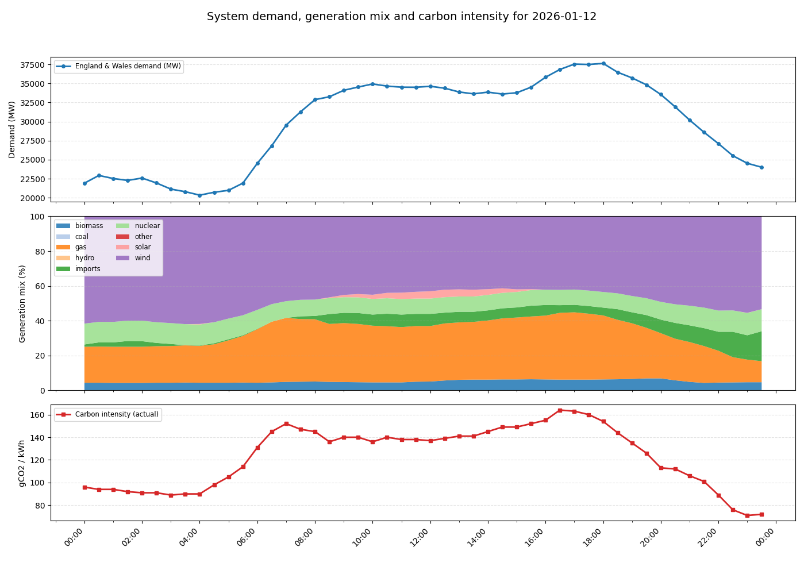
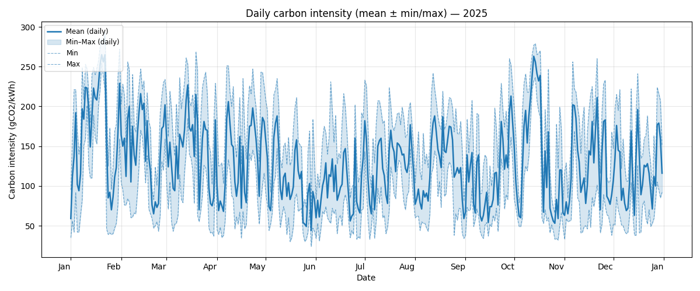

:::::::::::::::::::::::::::::::::::::: questions

- What is energy?
- What is power?
- How power and energy relate to carbon emissions?
- What other sources of carbon involve digital research?
- How do we calculate carbon emissions?

::::::::::::::::::::::::::::::::::::::::::::::::

::::::::::::::::::::::::::::::::::::: objectives

- Explain what energy and power are
- Explain how energy is produced
- Explain what low-carbon energy sources are and how they opperate
- Explain what embeded carbon is
- Use the greenhouse gas (GHG) protocol to estimate carbon emissions

::::::::::::::::::::::::::::::::::::::::::::::::

(This episode will be heavy on pointing to the [Green software practitioner course] sections)

## Energy and power

Energy is a physical property that can be used to do work. This can be lifting a weight,
pushing a piston or even running a computation on a computer. The SI unit of energy is
the Joule (J) but commonly the kilowatt-hour (kWh) is also used when expressing electrical
energy use.

Power is a rate at which energy is consumed i.e., how much energy is used in a given
amount of time. The SI unit of power is the watt (W) however kilowatts (kW) are commonly
used as well.

::::::::::::::::::::::::::::::::::::: callout

## Joules, kilowatts and kilowatt-hours

The units used for power and energy can be confusing, particularly kilowatt-hours as a
unit of energy. A useful relation to bear in mind is that $1 W = 1 J/s$. By multipling
watts by another unit of time we recover units of energy with a scaling factor.

Kilowatt-hours are commonly used because they tend to work out nicely for everyday
situations, e.g. a kettle may have a power rating of 1 kW so running it for an hour
gives 1 kWh of electrical energy used.

:::::::::::::::::::::::::::::::::::::::::::::

::::::::::::::::::::::::::::::::::::: challenge

## Praticing units of power and energy

Which of the below are not equal to 1 kWh.

- A - 200 W consumed for 12 minutes.
- B - 1000 J
- C - 3,600,000 J
- D - 5000 W consumed for 12 minutes.

:::::::::::::::::::::::: solution

## Answers

- A - 0.2 kW x 0.2 hours = 0.04 kWh
- B - 1000 J = 0.00027 kWh
- C - 3,600,000 J = 1 kWh
- D - 5 kW x 0.2 hours = 1 kWh

:::::::::::::::::::::::::::::::::

:::::::::::::::::::::::::::::::::::::::::::::::

## Energy sources and carbon emissions

Energy famously cannot be created or destroyed but the electrical energy used for research
activities has to come from somewhere. In practice the majority of electrical energy used for
digital research comes from a national electricity grid so this will be our focus.

The electrical grid serves to transport energy from electricity generators to end users.
Economies of scale tend to mean that electricity generation is a large scale activity.
The electrical energy supplied to the grid comes from a variety of different sources.
This can be fossil fuels like coal and gas or green energy sources like solar and wind.

A key feature of electrical grids is that supply must be balanced with demand. Demand
for electricity can vary greatly throughout a year or even an individual day. The grid
responds to increases in demand by purchasing additional electricity from suppliers.

### Energy Mix and Carbon Intensity

Different methods of electricity generation have different properties. Some of the important
include:

- Cost - The cost of generating each kWh of energy.
- Carbon Intensity - A measure of the kgCO2e emitted per kWh of energy.
- Dispatchability - How easily or quickly generation can be scaled up in response to
  demand.
- Predictability - How easy it is to predict the amount of generation available.

::::::::::::::::::::::::::::::::::::: callout

The table below provides a quick summary of how different energy sources compare on
their key properties:

| Energy source | Cost | Carbon intensity | Dispatchability | Predictability |
| --- | --- | --- | --- | --- |
| Gas | Medium | Medium | High | High |
| Solar | Low | Low | Low | Low |
| Wind | Low | Low | Low | Low |
| Nuclear | High | Low | Medium | High |
| Hydro | Variable | Low | Low | High |

::::::::::::::::::::::::::::::::::::::::::::

While solar and wind are very good in terms of cost and carbon intensity, they are
unable to respond effectively to changes to demand. Gas, and to some extent, nuclear,
while less appealing otherwise, can respond to these quick changes and hence complement
green sources.

The energy sources used by the grid will change on an hourly timescale and some sources
such as wind and solar can be subject to seasonal and climate effects. The relative cost
of different sources can also be impacted by global events and markets. The sources of
electricity used by the grid are referred to as the energy mix. The energy mix of the
grid leads to an overall carbon intensity value given as gCO2/kWh of electricity
generated. This can also be broken down by geographical region or given as an average
for a time period.

A key aspect to note is that renewable sources of electricity generation are usually
the cheapest option so the electricity grid will always try to minimise costs by using
renewable sources where possible. This shows that if we can shape our demand for
electricity to times where more renewable energy is available we both reduce emissions
and provide an economic drive for more investment in renewable sources and less 
investment in sources of electricity generation based on fossil fuels.

### Carbon Intensity in the UK

The following graphs show a typical UK day in 2026.

<!-- markdownlint-disable-next-line line-length -->
{alt="Three graphs showing the relationship between the electricity demand, energy mix and carbon intensity of the UK power grid over the course of a day."}

The following dynamics are at play:

- At midnight initial energy demand and carbon intensity is low.
- Around 5am, energy usage begins to increase as people wake up and businesses open. As
  demand increases, the proportion of gas in the energy mix increases as more gas
  generation is brought online to keep the grid balanced. This also drives an increase
  in carbon intensity.
- Carbon intensity peaks in the morning around 7am. Although energy demand continues to
  rise, gas usage and carbon intensity drop slightly as cheaper imported energy becomes
  available. Slightly later a small amount of solar power also becomes available as the
  sun rises.
- Demand remains steady throughout the day before increasing in the evening. This is
  driven by domestic usage as people come home, cook and use domestic appliances. Again
  additional gas generation is brought online to meet the demand and carbon intensity
  rises to its peak value.
- As the evening progresses and people go to bed, demand drops again and carbon
  intensity also falls as gas generation goes offline. Overall carbon intensity ends up
  lower at the end of the day than the beginning as more imported energy is available.

<!-- ART Comment

Why does imported electricity have a low carbon intensity? Where do the imported carbon intensity numbers come from and are they accurate?

-->

:::::::::::::::::::::::::: callout

## Takeaways

- The pattern shown is typical for a day in the UK. There are however many other factors
  that can determine the relationship between demand and carbon intensity which can play
  out at a variety of timescales.

- There is considerable variability in the carbon intensity of electricity throughout
  the day - a factor of two in the above example. A simple strategy to reduce the
  emissions from digital research is therefore to shift electricity usage to times when
  carbon intensity is low. This is known as demand shifting. A simple rule of thumb is
  to favour running computationally intensive work at night.

- Gas is a key part of the UK's energy mix because of it's dispatchability i.e., it's
  ability to rapidly respond to changes in demand. Some green technologies like solar
  and wind have low dispatchability as they depend on factors like the weather.

::::::::::::::::::::::::::::::::::

<!-- markdownlint-disable-next-line line-length -->
{alt="A graph showing the daily carbon intensity of the UK power grid during 2025. The mean, maximum and minimum values for each day are shown."}

The above graph demonstrates how carbon intensity can vary throughout the year. Whilst
there is little pattern month to month, it is interestirng to observe that the mimimum
and maximum carbon intensity of the grid can vary between ~50 gCO2/kWh and ~250
gCO2/kWh, a factor of five.

:::::::::::::::::::::::::: callout

## Carbon Intensity Forecasts

For the UK there are publically available forecasts for the carbon intensity available
at <https://carbonintensity.org.uk>.

::::::::::::::::::::::::::::::::::

:::::::::::::::::::::::::: callout

## Data sources

The above graphs were generated from publicly available data provided by the [National
Energy System Operator]. Data was sourced from the [UK Carbon Intensity API] and the
[NESO Data Portal]. The scripts used to generate the graphs available on GitHub in [ImperialCollegeLondon/digital_research_sustainability_visualisations].

::::::::::::::::::::::::::::::::::

[National Energy System Operator]: https://www.neso.energy/
[UK Carbon Intensity API]: https://carbonintensity.org.uk/
[NESO Data Portal]: https://www.neso.energy/data-portal
[ImperialCollegeLondon/digital_research_sustainability_visualisations]: https://github.com/ImperialCollegeLondon/digital_research_sustainability_visualisations

## Embodied carbon and carbon awareness

So far we've focussed on the relationship between carbon emissions and electricity
usage. This is relevant to the operation of equipment used in digital research and is
usually the dominant component of the **operational carbon**. Another key source to
consider however are **embodied emissions**.

Embodied carbon is the greenhouse gas emissions produced during the full lifecycle of a
product or system before it starts being used: raw material extraction, manufacturing,
transport, construction and eventual disposal or recycling. It represents the "upfront"
carbon locked into goods and infrastructure. Accounting for embodied carbon helps teams
choose lower‑carbon options by considering repair, reuse, material choices and service
life in addition to operational energy use.

We'll discuss in detail the embodied carbon contributions associated with digital
research activities in the next episode.

## The Greenhouse Gas (GHG) Protocol and how to use it

So far we've discussed several sources of emissions. A key requirement to managing and
reducing emissions is to measure and account for them. The [Greenhouse Gas Protocol]
provides a framework for identifying and categorising different emission sources. It's
holistic and covers both direct and indirect emission sources.

The GHG protocol breaks down emissions into three categories called scopes:

- **Scope 1** are direct emissions. These come from activities that directly emit carbon
  such as burning fuel. This would cover fuel used in a vehicle or an on-site heating
  system or electricity generation.

- **Scope 2** are indirect emissions. These come activities that consume energy produced
  elsewhere. This is primarily the emissions associated with electricity generation
  covered in detail above.

- **Scope 3** are "Value chain emissions". These come from everything upstream i.e.,
  requirements you need to carry out research activities and everything downstream i.e.,
  emissions associated with the use of your research outputs, even by others. Upstream
  emissions includes things like the embodied emissions of hardware whilst downstream
  emissions might include use of software or data you've created.

The GHG protocol is most often applied to businesses, countries or cities but it can be
applied at any scale including an individual or research group. It's easy to get hung up
on which scope to place emissions in but perhaps the key takeaway is to take a broad
view of different emissions sources.

[Greenhouse Gas Protocol]: https://ghgprotocol.org/

::::::::::::::::::::::::::::::::::::: challenge

## According to the GHG protocol, what are the carbon emissions of...?

- Using a laptop in the office for coding 4h a day, 5 days a week. No calculations run.
- Brewing 5 cups of coffee per day, at home, 5 days a week.

:::::::::::::::::::::::: solution

## Output

No idea. We need to do it.

:::::::::::::::::::::::::::::::::

:::::::::::::::::::::::::::::::::::::::::::::::

[Green software practitioner course]: https://learn.greensoftware.foundation/
