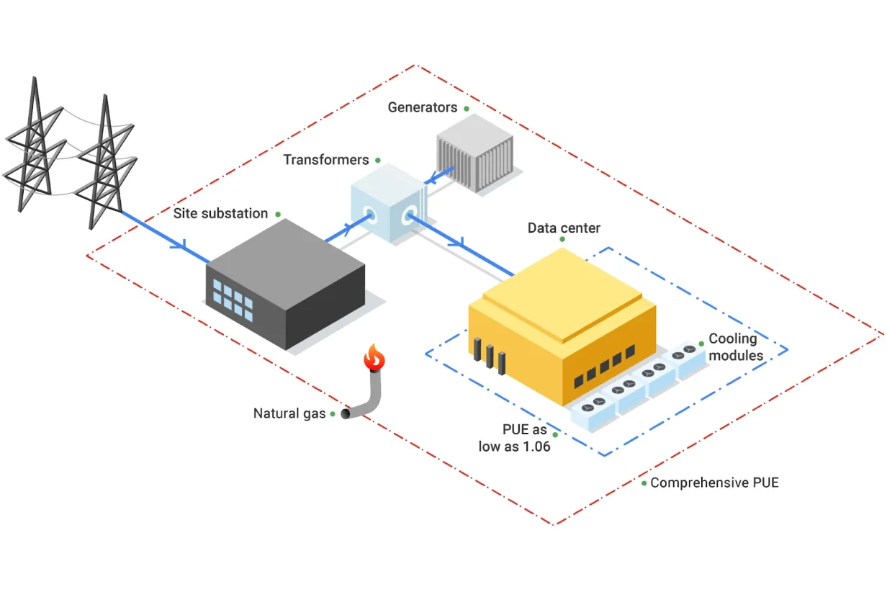

:::::::::::::::::::::::::::::::::::::: questions

- What digital research activities can have sustainability issues?
- How do different types of data storage (local vs cloud) contribute to carbon emissions?
- What factors influence the energy and power consumption of digital research workflows?

::::::::::::::::::::::::::::::::::::::::::::::::

::::::::::::::::::::::::::::::::::::: objectives

- Identify which aspects of a research workflow are most carbon‑intensive and why.
- Explain how different storage technologies (SSD, HDD, LTO tape) differ in embodied and
 operational carbon emissions.

::::::::::::::::::::::::::::::::::::::::::::::::

## Digital Research Infrastructure

Modern digital research depends on infrastructure ranging from individual computers and
devices up to the globe spanning network of the internet. In this section we'll look at
some of the different components of digital infrastructure and their relation to carbon
emissions.

<!-- markdownlint-disable-next-line line-length -->
{alt='Person thinking on different aspects of digital infrastructure that produce carbon emissions, showing computers, storage devices, data centres and the research activity itself.'}

## Computers

Computers have become an indispensible component of modern life as well as digital
research. These include everyday devices such as a laptop or desktop PC used to check
email as well as servers accessed remotely.

Everyone in research uses a laptop, desktop PC or workstation to do their work, even if
they are not involved in coding or running simulations. Browsing the web or checking the
email are everyday activities that consume energy. These are all called _operational
carbon emissions_.

But just the fact that you have one of these machines, also has a carbon impact. This is
related to the process of sourcing the materials the computer is made off, manufacturing
and transporting it. These are called _embodied carbon emissions_.

Both embodied and operational emissions play a significant role in the carbon footprint
of computing devices, but how to estimate them and reduce them is very different.

### Embodied emissions

Embodied carbon emissions **do not change** once the machine is in your hands: they only
depend on the manufacturing and transport process. However, **embodied carbon emissions
per year** are reduced the more years the machine is in use. Hence, the longer the
lifetime of the machine, the lower their embodied carbon footprint per year.

::::::::::::::::::::::::::::::::::::: callout

Before replacing a computer, make sure that it is really needed and that it is no longer
fit for purpose.

- Can you replace just some parts to extend its lifetime, eg. memory, GPUs?
- Can you give it another useful purpose?
- Can you donate it to charity (eg. see options in the [Device Donation Scheme]) to
  extend its useful life instead of trashing it (or recycling it)?

:::::::::::::::::::::::::::::::::::::::::::::

Finding the embodied carbon emissions of computers often relies on the information
provided by the manufacturers themselves, which might be vague or based on different
assumptions. However, it is a good starting point for estimating the carbon impact of
your research activities.

Below there is a list of common laptop manufacturers' webpages providing information on
their product's embodied carbon emissions. If your machine is custom made or very old,
you might need to dig into the individual parts's manufacturers, as well.

As a specific example, [in this link](https://h20195.www2.hp.com/v2/GetDocument.aspx?docname=c08207991)
you have the report corresponding to the laptop model used to write this bit of the
course, an HP EliteBook 840 G9, also shown in the following image.

<!-- markdownlint-disable-next-line line-length -->
{alt='Embodied carbon emissions for HP EliteBook 840 G9.'}

If we exclude the `Use` section of the chart, which obviously depends on the usage and
the location, as discussed in the [previous episode](02_carbon.md), the remaining,
related to production and transportation, accounts for about ~80% of the estimated
total, i.e. 160 kgCO₂e.

It should be noted that different manufacturers use different criteria to calculate
their embodied emissions, so choosing the computer with the lowest reported embodied
emissions is not necessarily the best approach. Other aspects like the expected
lifetime, the possibility of replacing individual components, etc. might be more useful
and impactful aspects to look at.

::::::::::::::::::::::::::::::::::::: challenge

#### What are the embodied carbon emissions of your computer?

Find the model of the computer you are using right now to do this course and try to find
out its embodied carbon emissions. The links below from some manufacturers might be
useful.

- Which part produces a larger carbon footprint?
- If it is a laptop and the battery is failing, how much carbon could you save if you
  just replace the battery for a new one instead of replacing the whole laptop?

:::::::::::::::::::::::::::::::::::::::::::::::

### Operational emissions

Operational emissions are those that are produced when _using_ the equipment. They depend
on its design and performance, but also on _how_ it is used and _where_ it is used. For
the latter reason, it is often better to consider the energy usage, rather than the
carbon emitted as this depends on the energy mix where the machine is being used.

#### Idle energy usage

These represent a baseline of energy usage just because of the computer (and the monitor
in the case of desktop computers) being on. There are a number of factors that influence
this:

- The age of the computer: Modern computers have generally more advanced technology that
makes them more energy-efficient than older ones.
- Nature of the computer: Laptops, designed to work with batteries, are often also more
energy efficient than desktops.
- The power management settings: That control when to go to sleep after a time of inactivity,
switch the screen off, etc. have a very strong influence on the idle energy consumption.
- Peripherals: Especially, monitors (sometimes having two or more), but also printers
can also consume large amounts of energy.

To figure out the idle energy consumption of a specific machine, one option is to check
the [ECO Declaration] for the equipment. All manufacturers need to provide this document
where, in principle, you can find such information. For example, the [ECO declaration of
the HP EliteBook 840 G9] indicates an energy consumption of 22.67 kWh/year. This
declaration also includes useful information about the product, like which components
can be replaced or upgrade, useful knowledge to reduce the embodied emissions, as
pointed out above. Having said that, this document is sometimes not as complete as it
should, or might not represent the exact configuration of your machine. Or might not
even exist if the machine has been made bespoke with specific components.

In this case, the best option to get the idle energy usage of a machine is to use a plug
in power meter. These plug in the mains socket and then the computer and any other
peripherals, like monitors, can be plugged to it (possibly via a power strip). There are
many models, but most will provide both the instantaneous power and the energy used over
a period of time.

Once the baseline energy usage is found, strategies can be defined to reduce it, like
adjusting the power management settings, changing usage habits, etc.

::::::::::::::::::::::::::::::::::::: challenge

#### What are the idle energy usage of your computer?

Like in the previous exercise, try to find the ECO Declaration for your computer
in the manufacturer's webpage.

- What's such an energy consumption?
- How easy was to find it?

:::::::::::::::::::::::::::::::::::::::::::::::

#### Application energy usage

Once you start doing any work with a computer it's power usage will rise above its idle
consumption. This is caused by components like the CPU, GPU or memory using more power
to complete the computational work. There may also be increased power requirements to
keep components cool.

Typically, you will be interested in the energy usage of specific applications, so you
can minimize its energy usage. For example, a particular simulation software you have
been working on or a 3D visualization tool.

This is not an easy task, and the solution depends greatly on your accessibility to the
source code of the application, as well as the hardware you are using.

If you do have access to the source code, then you could use tools like the
[Intel's Performance Counter Monitor (PCM)] (which [can be used in C++ programs]) or [Codecarbon]
(for Python programs). These tools require some setting up - and obviously modify your
code - but will give you the most accurate readings of the energy usage specific for
your application.

If you do not have access to the source code, then your only option is to rely on
external tools to monitor the energy usage of the application (e.g. using PCM) or to
calculate it based on the hardware being used and the time it is being used for using
the [Green Algorithms Calculator], for example.

It is beyond the scope of this course to teach you how to use any of these tools, given
the range of use cases and configurations, but in the case studies described in the next
episodes, there will be examples of how some of these can be employed in practice to
understand your energy usage and consider ways of reducing them.

### Product Carbon Footprint of different manufacturers

- [HP](https://h20195.www2.hp.com/v2/library.aspx#doctype-95&country-us&sortorder-popular&teasers-off&isRetired-false&isRHParentNode-false&titleCheck-false)
- [Lenovo](https://compliance.lenovo.com/content/esg-document-library/en/esg.html?1_group.propertyvalues.property=.%2Fjcr%3Acontent%2Fmetadata%2FdocumentType&1_group.propertyvalues.operation=equals&1_group.propertyvalues.7_values=PCF%20Sheets&layout=card&p.offset=0&p.limit=24)
- [Dell](https://www.dell.com/en-uk/lp/dt/product-carbon-footprints)

[Device Donation Scheme]: https://www.london.gov.uk/coronavirus/volunteer-and-donate/device-donation-scheme
[ECO Declaration]: https://ecma-international.org/publications-and-standards/standards/ecma-370/
[ECO declaration of the HP EliteBook 840 G9]: https://h20195.www2.hp.com/v2/GetDocument.aspx?docname=c08155359&search=HP%20EliteBook%20840%20G9
[Intel's Performance Counter Monitor (PCM)]: https://github.com/intel/pcm
[can be used in C++ programs]: https://greencompute.uk/Measurement/RAPL
[Codecarbon]: https://github.com/mlco2/codecarbon
[Green Algorithms Calculator]: https://calculator.green-algorithms.org/

## Storage Devices

Research datasets are increasingly large and replicated across multiple systems for
reliability. As modern research practices move toward open data and long-term storage,
the embodied and operational emissions of storage becomes a significant component of
digital research's environmental impact.

<!-- markdownlint-disable-next-line line-length -->
![History of digital storage media. Image from the blog post ["Data storage through history"]](https://www.anycloud.dk/wp-content/uploads/2023/07/2-1.png){alt='Timeline with the history of digital storage media showing: punchcards (1881), magnetic tape (1950), removable hard drives (1963), floppy discs (1971), CD-ROM (1983), SD Cards (1999), USB drives (2000) and cloud (2013).'}

There are a few different storage mediums in common use:

- **Solid-State Disk Drives (SSD)**: They use flash memory with no moving parts to store
  data, much like SD cards and USB drives, but with much larger capacity. Their embodied
  carbon emissions are high due to the rare metals needed for semiconductor manufacturing,
  while operational emissions are somewhat lower than for spinning disks.
- **Hard Disk Drives (HDD)**: They store data on spinning magnetic disks. Embodied
  emissions are lower than those of SSDs but operational emissions are higher because
  their disks must spin continuously.
- **Linear Tape-Open (LTO Tape)**: Magnetic tape technology used for long-term storage.
  Their embodied emissions are low, while their operational emissions are near
  zero.

Similarly to computers, their associated carbon emissions can be split into operational
and embedded components. These are summarised below:

| Category | SSD | HDD | LTO tape |
| :--- | :--- | :--- | :--- |
| **Embodied Carbon** | High (16-32 kg)^1^ | Moderate (2-4 kg)^1^ | Low (~0.07 kg)^3^ |
| **Operational Carbon** | Low (2-5 kg)^1^ | Moderate - High (2-16 kg)^1,2^ | Low (~0 kg) |
| **Lifespan** | 5–10 years | 5-10 years | 30+ years |

\* Emissions are in **kgCO₂e per TB per year**

While the numbers vary depending on manufacturers and reporting available, it is generally
considered that SSDs have a higher carbon debt per unit of storage than HDDs^4^.
However, recent data suggests that the difference for enterprise-grade drives is shrinking,
and new SSDs have only 2x the embodied carbon of comparable HDDs^5^.
While the numbers vary depending on manufacturers and reporting available, it is
generally considered that SSDs have a higher 'carbon debt` per unit of storage than
HDDs^4^. However, recent data suggests that the difference for enterprise-grade drives
is shrinking, and new SSDs have only 2x the embodied carbon of comparable HDDs^5^.

SSDs allow data to be accessed almost instantly and are typically 10–100× faster than
HDDs. LTO tapes offer the slowest access speeds, but they remain the preferred option
for storing cold data due to their low cost, low embodied emissions and great energy
efficiency.

["Data storage through history"]: https://www.anycloud.dk/anycloud/data-management/data-storage-thoughout-history/

## Data Centres

Beyond personal computing devices like laptops and PC's, much computing infrastructure
is now accessed remotely. In this case the computers are generally hosted in a Data
Centre, a large industrial facility that can contain thousands of servers and the
supporting infrastructure required to allow remote access.

<!-- markdownlint-disable-next-line line-length -->
![Data centers consume huge amounts of energy and water, which can be a risk for the environment. Image originally published at [The Seattle Times].](https://images.seattletimes.com/wp-content/uploads/2025/11/Data-Centers-ONLINE.jpg){alt="Cartoon showing a datacenter as a monster demanding more power."}

The carbon emissions associated with the computers in a data centre are covered by the
same considerations above. As purpose built facilities, data centres can host more
specialised equipment and benefit from economies of scale. They also have additional
emissions sources beyond the individual servers they house.

Data centre embodied emissions:

- **data-centre construction**: includes the concrete, steel, electrical infrastructure,
  etc.
- **networking and supporting hardware**: as the servers in a data centre are accessed
  remotely they must be serviced by network infrastructure such as switches and cables.
- **cooling**: the density of compute in data centres means they must have dedicated
  infrastructure for cooling. More information on this topic, in particular the water
  usage, is discussed below.

There are additional sources of operational emissions as well:

- **power for infrastructure**: this includes the networking infrastructure,
  cooling systems, lighting, etc.
- **power distribution overheads**: data centers deal with large amounts of electrical
  and encounter overheads in its distribution and transformation.

The energy efficiency of data centres is usually measured as their **Power Usage
Effectiveness (PUE)**, and determines how much of the energy entering the data centre
reaches the IT equipment used for servers and storage compared to the energy used for
cooling and lighting.

$$
\mathbf{PUE} = \frac{\text{Total Facility Power}}{\text{IT Equipment Power}}
$$

<!-- markdownlint-disable-next-line line-length -->
{alt="Google Data Center PUE measurement boundaries."}

An average data centre has a PUE of around 1.59, meaning that for every 1 watt used to
power computational resources, an additional 0.59 watts is spent on cooling and power
distribution. Newer and larger data centres tend to be more efficient^11^, with a global
average PUE of 1.41 in 2025^11^.

Data centres consume around 2.5% of the UK's electricity and the annual consumption
is expected to increase by 4 times by 2030^9^. In the U.S., data centres are predicted
to use up to 12% of the country's electricity by 2028, a 3x increase from 4.4% in
2025^8^.

The operational emissions of data centers depends heavily on the grid carbon intensity,
with lower emissions in renewable-powered regions and higher emissions in
fossil-fuel-dominated regions.

Despite the additional emissions sources, data centres have the ability to be far more
energy efficient than the equivalent collection individual computers or storage devices.
This is due to their scale and specialisation and the provision of infrastructure that
can be shared between many users.

Even still, it is wise to conduct due diligence checks on the data centres you aim to
utilise. As you may have heard
[in the news](https://www.theguardian.com/technology/2024/sep/15/data-center-gas-emissions-tech),
the industry frequently tries to obscure its true carbon footprint in a number of ways.
One such way is the use of renewable energy certificates (Recs), where a data centre
company can make itself appear to purchase some percentage of its energy from renewable
sources, despite that energy not reaching the facility. The companies frequently report
'market-based' emissions, which are manipulated by the inclusion of Recs, but look out
for the 'location-based' emissions figure for a less misleading view of their carbon
footprint.

| Category | Data Center | Local Equipment |
| :--- | :--- | :--- |
| **Embodied Carbon** | Lower (shared + efficient infrastructure) | Higher (duplication + under‑used hardware) |
| **Operational Carbon** | Usually lower (efficient cooling) | Usually higher (older facilities + local grid) |
| **Energy Efficiency** | High (fewer idle disks) | Generally lower |
| **Utilisation** | High (resources shared across many users) | Lower (over‑provisioning) |

[The Seattle Times]: https://www.seattletimes.com/opinion/the-ai-energy-monster-is-coming-for-our-salmon-and-electricity/

### Data centres and water usage

While this course focuses on the carbon emissions via the electricity usage, there is
another big environmental factor associated to the running of data centres: water.

Water in data centres is used in huge amounts for cooling purposes. [Recent studies]
suggest that medium-size data centres consume more than 1 million litres of water per
day, while for large data centres, this number jumps to about 23 million litres per day,
equivalent to the daily usage of about 50,000 households in the US.

Except in cooler locations where natural or air-only cooling ("free cooling") can be
enough to extract all the heat generated during computation from the data centres, in
most cases, some level of water-based cooling is required. There are two broad methods
for water-cooled data centres:

- **Using air cooling with water evaporation in chillers**. This is an open-loop method
where water is lost into the atmosphere - hence removing it from the reservoir it was
taken from, and therefore wasteful - but it is technically simpler to implement.
- **Via direct liquid cooling**, where the coolant (not necessarily water) is directly in
contact with the processing unit. [Direct-to-chip liquid cooling and immersive liquid cooling]
are two server liquid cooling technologies that dissipate heat while significantly
reducing water consumption, but at a much higher cost and technical complexity.

While not as commonly available as the Power Usage Effectiveness (PUE), some data
centres provide a [Water Usage Effectiveness (WUE)] that measures how much water is used
per kWh of energy used. The ideal cases is 0 l/kWh, where no water at all is used, but
most common values are around 1.9 l/kWh.

[Recent studies]: https://www.eesi.org/articles/view/data-centers-and-water-consumption
[Direct-to-chip liquid cooling and immersive liquid cooling]: https://www.datacenterdynamics.com/en/analysis/an-introduction-to-liquid-cooling-in-the-data-center/
[Water Usage Effectiveness (WUE)]: https://www.datacenterknowledge.com/cooling/a-guide-to-data-center-water-usage-effectiveness-wue-and-best-practices

::::::::::::::::::::::::::::: callout

## Data Centres and The Cloud

The "cloud" is the delivery model for computing services over the internet. Cloud
services are implemented and run on physical data centres owned and operated by cloud
providers. Because cloud providers benefit from the advantages of data centre hosting,
cloud deployments are often more energy and carbon efficient than many small scale
on‑premise setups - but the cloud's actual footprint still depends on the provider's
hardware, PUE, electricity grid mix and redundancy/replication practices.

:::::::::::::::::::::::::::::::::::::

::::::::::::::::::::::::::::::::::::: instructor

Depending on the size of the group and their engagement, the following challenge can also
be done collectively as a class:

- Participants go in turns suggesting items, and the instructor writes them in a whiteboard
- Participants write items in post-its and then stick them on a wall

Both options can be done for remote delivery of the course, using digital whiteboards.
Finally, the instructor comments on the results.

:::::::::::::::::::::::::::::::::::::::::::::::::

::::::::::::::::::::::::::::::::::::: challenge

## What do you use data centres for?

There are way more things that we initially may think that make use of data centres, some
related to digital research but plenty of others than do not.

In small groups, reflect and discuss what daily activities pof your everyday life make
use of data centres, sorting them into digital research, other work-related activites,
and personal activities.

- Where do you have more items?
- Which category do you think consume more data centre power?
- After talking to your colleagues, was there any surprise on things that use data centres?

:::::::::::::::: solution

Each group is likely to have a different list, but some of the items that are likely
to be present in most of them are:

- Digital research
    - Store some code in GitHub, Codeberg or other platform
    - Run continuous integration workflows
    - Run software - including AI training - in cloud services
    - Store large amounts of research data with a cloud provider
- Other work related activities
    - Send emails
    - Meet colleagues via Teams or Zoom
    - Store some office documents in Onedrive, Dropbox or similiar
- Personal activities
    - Use instant message apps with familly and friends
    - Send personal emails
    - Stream music or films
    - Check social media
    - Order food
    - Buy items in online shops
    - Read newspapers online, blogposts or similar
    - Check the weather forecast
    - Check Google Maps or other similar applications
    - Review your bank account
    - ...

As you see, a lot of our daily activities go through a data centre somewhere
and while digital research will make heavy use of these facilities because they are
intensive workflows, the sheer amount of other small tasks can easily offset the carbon
emissions of the former when considered collectively.

:::::::::::::::::::::::::

:::::::::::::::::::::::::::::::::::::::::::::::

## Research Activities

### Simulation, Modelling and Data Analysis

The primary infrastructure required to carry out these activities is access to
computation. This can be provided by a laptop, desktop or a server hosted in a data
centre.

Factors to consider:

- **Embodied and operational emissions** are both key contributors. Optimally, a given
  amount of compute should be provided by the minimum associated embodied emissions.
  It's therefore key to maximise utilisation of hardware rather than investing in more.
  This strongly promotes using computational computational services based on shared
  infrastructure (such as cloud or high performance computing facilities) where
  utilisation can be kept high and operational emissions are greatly reduced compared to
  individual desktops or laptops.
- **Computational Architectures** have become increasingly diverse in recent years both
  for CPUs and for accelerators (e.g. GPUs). Computational problems can have very
  different electricity comsumption depending on the architecture used so choosing the
  right one can be very impactful.
- **Doing less computation** is also worth considering. This can take the form of
  planning computational workloads carefully to minimise resource usage or limiting work
  carried out for speculative or exploratory purposes.
- **Code optimisation** is the art of minimising the computational resources required to
  solve a given problem. This can take various forms depending on programming language
  and computational architecture but impressive speed ups can be obtained in some cases
  compared with unoptimised code.
- **Carbon awareness** is making your use of digital resources responsive to changes in
  carbon intensity of electricity generation. This can take different forms, for example,
  moving use to locations which have lower carbon intensities, changing the time at which
  you consume electricity to periods with lower carbon intensities or even making your
  workload intensity responsive to carbon intensity forecasts to minimise operational
  emissions.

### Research Data Management

#### Storing Data

Generally when presented with a choice between buying your own storage devices or using
a storage service, it will be more sustainable to use the latter. That said, local
storage has a number of advantages, including greater control over data, predictable
access speeds, and the ability to power equipment down when not in use. Typically
research organisations will provide dedicated storage services for research data.

Factors to consider (to be expanded):

- Delete unused or redundant data and avoid unnecessary replication.
- Keep frequently accessed data on faster storage (SSDs) and move "cold"
  or infrequently accessed data to slower but more energy efficient systems (tape
  storage)^12^.
- Use compression and efficient file formats to reduce storage requirements
- Consider cleaning and preprocessing data locally before storing.
- Choose storage options designed for infrequent access when appropiate.

::::::::::::::::::::::::::: callout

#### Data Management Plans

The best time to think about how to manage you data is before you collect or generate
it. This is the purpose of a Data Management Plan (DMP), a document that describes how you
will handle your data during and after a research project. DMPs are often required by
funding agencies and research institutions, but they are also a good practice to ensure
that your data is well organised, documented and preserved.

In addition to being a good scientific practice, DMPs can also help you to reduce
the carbon footprint of your data. Tracking and monitoring your data in this manner
can help you to identify (and where possible, avoid) unnecessary data collection and
storage. This will in turn help you to make informed decisions about your data
management practices and making them more sustainable.

The UK Data Service provides a [data management planning overview](https://ukdataservice.ac.uk/learning-hub/research-data-management/plan-to-share/data-management-planning-overview/)
and a [checklist](https://ukdataservice.ac.uk/learning-hub/research-data-management/plan-to-share/checklist/)
of key points to consider when creating a DMP.

:::::::::::::::::::::::::::::::::::

### Use of Computational Services

Rather than directly using a computer, many digital research activities are provided by
accessing services over the internet. Ultimately these services are provided by physical
infrastructure however, as an end user, it can be very difficult to know how your
activity corresponds to resource consumption. In these cases we usually have to depend
on information from the service provider or make relative comparisons through proxy
metrics.

It's not possible to comprehensively cover the services used in modern digital research
so below we've chosen a few examplars to look at in detail.

#### GitHub

In a research study on [Environmental Impact of CI/CD
Pipelines](https://arxiv.org/abs/2510.26413) the authors estimates that the carbon
footprint from GitHub Actions range from 150.5 MTCO₂e in the most optimistic scenario to
994.9 MTCO₂e in the most pessimistic scenario. The most likely scenario estimates are
456.9 MTCO₂e which is equivalent to the carbon captured by 7,615 urban trees in a year.

The study also compares the carbon emissions of GitHub Actions with the emissions of
quotidian activities.

{alt="Comparison between the yearly
carbon emissions of the GitHub Actions ecosystem and the emissions of
quotidian activities."}

#### Generative AI

Increasingly, generative AI services are used to generate text, images and computer code
with consequent diverse applications in digital research. Emissions associated with
generative AI models can be split into two components:

- **Training** is carried out as a one-off process before you even interact with a model.
  These are all of the resources required to gather training data, design the
  architecture and parameterise model weights.
- **Inference** occurs whenever you interact with a model, typically by providing a
  prompt. This refers to the energy required to transmit your prompt, generate the
  response and transmit it back to you.

There are some important driving factors to bear in mind when interacting with LLMs
that can drive emissions:

- **Model size**: Larger models typically require more energy to run.
- **Query count**: The more queries you make to a model, the more energy it will
consume. Hence, being mindful of the number of interactions and trying to batch queries
when possible can help reduce emissions comparatively.
- **Response token count**: The length of the response generated by the model can also
impact energy usage, as longer responses require more computation. Reducing the length of
the response by being more specific in your prompt might help.

### References

1. [Swamit Tannu and Prashant J. Nair. 2023. The Dirty Secret of SSDs: Embodied Carbon. SIGENERGY Energy Inform. Rev. 3, 3 (October 2023), 4–9](https://dl.acm.org/doi/10.1145/3630614.3630616)
2. [Based on Seagate EXOS X18](https://www.seagate.com/content/dam/seagate/assets/esg/planet/product-sustainability/files/life-cycle-assessment-exos-x18.pdf)
3. [Based on LTO 9 - FUJIFILM. _Sustainability Report 2020_. 2020](https://www.fujifilm.com/files-holdings/en/sustainability/report/2020/sustainability_activity_report_2020_ff_sr_2020_all_a4_E.pdf)
4. [Rteil, N., Kenny, R., Andrews, D., & Kerwin, K. (2025). Understanding the carbon footprint of storage media: A critical review of embodied emissions in hard disk drives. International Journal of Environmental and Ecological Engineering, 19(11), 263–270](https://researchportal.lsbu.ac.uk/ws/portalfiles/portal/15145533/understanding-the-carbon-footprint-of-storage-media-a-critical-review-of-embodied-emissions-in-hard-disk-drives_1_.pdf)
5. [How Do the Embodied Carbon Dioxide Equivalents of Flash Compare to HDDs?](https://blog.purestorage.com/perspectives/how-do-the-embodied-carbon-dioxide-equivalents-of-flash-compare-to-hdds-part-1/#:~:text=Instead%20of%20an%208x%20difference,continue%20well%20into%20the%20future.)
6. [Digital Decarbonisation - CO₂e Data Calculator](https://digitaldecarb.org/co2-data-calculator/)
7. [WholeGrain DIgital Report](https://www.wholegraindigital.com/digitaldeclutter/#cloud-storage)
8. [National Energy System Operator](https://www.neso.energy/neso-implements-electricity-grid-connection-reforms-unlock-investment-great-britain)
9. [U.S. Department of Energy - 2024 Report on U.S. Data Center Energy Use](https://escholarship.org/uc/item/32d6m0d1)
10. [Uptime Institute, Large data centres are mostly more efficient, analysis confirms, 7 February 2024](https://journal.uptimeinstitute.com/large-data-centres-are-mostly-more-efficient-analysis-confirms/)
11. [IEA, Energy and AI, April 2025, p259](https://www.iea.org/reports/energy-and-ai)
12. [Sustainable computing in science - EMBL-EBI](https://www.ebi.ac.uk/training/online/courses/sustainable-computing-in-science/what-can-we-do/good-practices-in-data-management/)
13. Poster on [Environmentally-aware use of GitHub
Actions](https://zenodo.org/records/12754189) and the [associated GitHub repository](https://github.com/ImperialCollegeLondon/game_of_life)
14. Blog post on [Adopting a more rational use of Continuous Integration with GitHub Actions](https://imperialcollegelondon.github.io/RSEBlog/2024/06/26/adopting-a-more-rational-use-of-continuous-integration-with-github-actions/).
