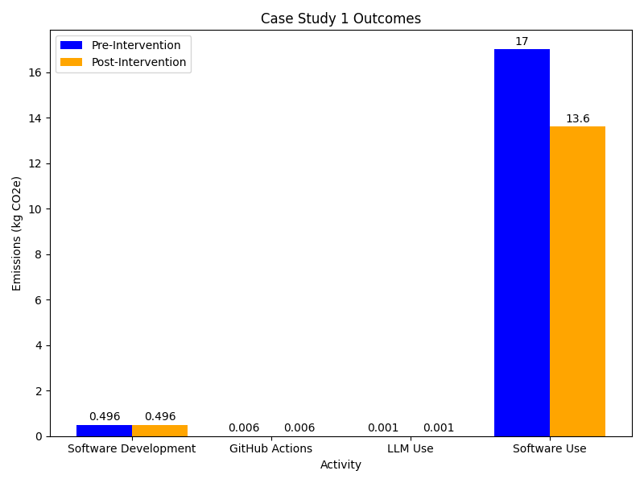

:::::::::::::::::::::::::::::::::::::: questions

- What are the main sources of carbon emissions in research software development and
  deployment?
- How can a Research Software Engineer measure and estimate emissions from software
  development, CI/CD workflows, LLM usage, and software execution?
- What strategies can reduce carbon emissions from widely-used research software?
- How do emissions from software usage compare to emissions from software development?

::::::::::::::::::::::::::::::::::::::::::::::::

::::::::::::::::::::::::::::::::::::: objectives

- Collect and organize data needed to estimate carbon emissions across the software
  development lifecycle, including development, testing, and user execution.
- Calculate carbon emissions from different activities using appropriate tools.
- Analyze emissions data to identify the most significant sources and prioritize
  reduction efforts.
- Design and implement emission reduction strategies including code optimization,
  improved user documentation, and better error handling.

::::::::::::::::::::::::::::::::::::::::::::::::

## Scenario

Celia is a Research Software Engineer that works as part of a research group. Two years
ago, she developed and released a Python package (hosted on PyPI) with a novel data
analysis technique relevant to her research area. The package has been a big success and
has been widely adopted. However, she has heard from some users that they are using it
on increasingly large datasets that leads to demanding memory requirements and slow
performance.

Celia is concerned about the environmental impact of her software package.
She wants to assess the carbon emissions associated with both the development
and usage of her package and identify ways to reduce these emissions.

Celia should assess the balance of emissions involved in development of the code
base versus its usage. She should look at how to estimate these then focus her
emission reduction measures appropriately.

## Collecting Information

::::::::::::::::::::::::::::::::::::: challenge

### Data exploration (20 minutes)

Celia decides to learn more about each of the emission sources, she inspects
the following areas of her work:

1. The hardware she uses for software development
1. Use of GitHub Actions for continuous integration and testing
1. Use of LLMs
1. Users of her package

For each of these areas, what data and tools/methodologies does Celia need to
collect information on the emissions associated with her software?

:::::::::::::::: hint

Use the following questions to guide your exploration of each of these areas:

### Hardware

- Look up the specifications of her laptop. Also note how much time she spends using
it for software development.
- Is the development process computationally intensive?
- Can the Product Carbon Footprint (PCF) datasheet be found for her laptop?
- Can a tool like the [Green Algorithms Calculator] help with estimating any of
    the emissions?

### GitHub Actions

- Does she have data on how often her workflows run and how long they take to execute?
- Can she use a tool like [ECO CI] to estimate the emissions from her workflows?

### LLM Use

- Does she have data on how often she uses LLMs and which ones she uses?
- Can she use a tool like the [Hugging Face Ecologits calculator] to estimate
the emissions from her LLM usage?

### Software Usage

- Who are the users of her package and what hardware are they using to run it?
- How long are they running her package for?

[Green Algorithms Calculator]: https://calculator.green-algorithms.org/
[ECO CI]: https://www.green-coding.io/products/eco-ci/
[Hugging Face Ecologits calculator]: https://huggingface.co/spaces/genai-impact/ecologits-calculator
:::::::::::::::::::::

::::::::::::::::::::::::::::::: solution

Details on the data Celia collects for each of these areas are provided below.

### Hardware used

- Laptop used is an HP EliteBook 840 G9. She uses it for around 20 hours per week
for software development intermixed with other tasks.
- The development process is **not particularly computationally intensive** as she
mostly works with an Integrated Development Environment and runs the test suite occasionally.
- **Embodied emissions** of the laptop are available in its PCF sheet.
- **Operational emissions** can be estimated using the Green Algorithms
    Calculator. _Note_: A direct measurement of the power consumption of the laptop
    with a power meter could also be possible but given the relatively low emissions
    from consumer electronic devices, a rough calculation using the Green Algorithms
    Calculator is likely sufficient.

### Use of GitHub Actions

- Workflows run on any push to a branch, when a pull request is opened and when a
release is created.
- Looking over the last week, all of her workflows together have a runtime of around
2940 seconds.
- She adds ECO CI to her workflow and notes that the estimate for a workflow that
runs for 500 seconds is around 1 gCO₂e (including both operational and embedded emissions).

### Use of LLMs

- Uses GPT-5 mini for creating inline documentation for her code.
- On an average, she writes approximately 20 prompts to the agents every week.
- This particular agent typically provides short responses.
- Uses the [Hugging Face Ecologits calculator] to estimate the emissions from her
usage.

### Users of the software package

- Members of her research group are the main users of her package. They are able
to provide her with the full specification of the machine they are using - an
[HP Z2 Tower G1i Workstation]. They run the package for around 18 hours a week using
all the 20 cores.
- From individuals she's in contact with, conversations she's had at conferences, mentions
in academic papers and a workshop she ran recently, Celia estimates that her code has
around 30 regular users outside of her own research group.
- For the other users of her package, it is difficult to get detailed information
    on their usage.

[HP Z2 Tower G1i Workstation]: https://www.hp.com/gb-en/shop/product.aspx?id=8T229EA&opt=ABU&sel=DTP

::::::::::::::::::::::::::::::::::::::::
:::::::::::::::::::::::::::::::::::::::::::::::

## Analysis

::::::::::::::::::::::::::::::: challenge

## Estimating emissions (20 minutes)

With the information provided in the previous section what estimates can you create for
Celia's emissions from different activities (hardware used, GitHub actions, LLM
usage, and software usage)?

:::::::::::::::: hint

| Activity | Hint |
| --- | --- |
| Hardware | Use the PCF datasheet provided by the laptop manufacturer and consider the laptop's lifespan and weekly usage to calculate the embodied emissions. For the operational emissions use the Green Algorithms Calculator. |
| GitHub Actions | Scale the estimate from ECO CI to the full runtime of the workflows. |
| LLM Use | Use the Hugging Face Ecologits calculator to estimate the emissions. |
| Software Usage | Use the Green Algorithms Calculator to estimate the emissions from the users in her research group. Think about how might you estimate the emissions from other users of her package given the lack of detailed information on their usage? |

:::::::::::::::::::::

::::::::::::::::::::::: solution

Celia's estimates for the emissions from different activities are as follows:

### Hardware emissions

- The [PCF datasheet for the HP EliteBook 840 G9] gives a total of 176 kgCO₂e. Assuming
a 5 year lifespan of the laptop and a total weekly usage of 40 hours she calculates
the weekly proportion of embodied emissions to be 338 gCO₂e.
- The Green Algorithms calculator doesn't have data for her exact CPU model so she
looks up the Thermal Design Power of the processor and provides it. To get the
CPU utilisation she   decides to err on the side of caution and assume her development
activities use a full CPU core for the full 20 hours she spends developing. This
provides an estimate of 58 gCO₂e of operational emissions per week.

### Emissions from GitHub Actions

Given she has an estimate for a workflow of 500 seconds she chooses to simply scale
this up to the full runtime of 1640 seconds. This gives an estimate of around 6 gCO₂e
per week.

### Emissions from LLM usage

Using the Hugging Face EcoLogits calculator Celia estimates the emissions from her
weekly LLMs usage to be around 1 gCO₂e.

### Emissions from the users of the software package

- Celia has enough details to estimate her groups activities using the Green Algorithms
calculator. Doing for this the known runtime and hardware of her research group this
provides an estimate of 569.61 gCO₂e per week.
- To estimate the impact of other users of her software she could consider using
this number as a reference although it might make for a pretty rough estimate. This
would give an estimate of around 17 kgCO₂e per week of operational emissions.
- Celia decides to leave out the embodied component of the analysis as she doesn't know
enough about what hardware is being used to run her code.

[HP EliteBook 840 G9 PCF Sheet]: https://h20195.www2.hp.com/v2/GetDocument.aspx?docname=c09266068

:::::::::::::::::::::::

:::::::::::::::::::::::::::::::

## Taking Action

From the estimates Celia has made it's clear that the emissions associated with usage of
her package are the most significant. She also anticipates these growing over time given
the growing popularity of her package. The emissions from GitHub actions and LLM usage
are negligible.

::::::::::::::::::::::::::: discussion

## Measures to reduce emissions (20 minutes)

Celia identifies several ways she can improve the emissions associated with usage
of her code base as mentioned below. In your groups discuss the potential impact of
these measures and any other measures you think could be implemented.

### Code Optimisation

- Celia **uses a profiler** with her code to identify areas where the code could be optimised.
She identifies the areas of the code where the bulk of the computation is performed.
After some experimentation she finds a way to improve use of SIMD in a key calculation.
- Furthermore, she replaces the use of the `pandas` library with `polars` and reverses the
order of a conditional statement and a loop deep within the code, so that the former is
not checked several times unnecessarily. In her tests this gives a 7% performance boost
to the code.
- Her code also runs in parallel across multiple cores. Her profiling helps her to
identify that work is not being evenly distributed between cores leaving some cores idle
whilst they wait for others to finish. She implements a new algorithm to partition work
between the cores and with an overall 10% improvement in runtimes.
- Combined these steps reduce the computational resource usage of her code by 17%.

### User Support

- The users of her package (members of her research group) have been asking her for help
with optimising the performance of the code. She provides them with some tips on how to
optimise the performance of the code when they run it on their local machines.
Additionally, she **creates a detailed user guide** that includes instructions on how to
make the most efficient use of her package, including tips on how to optimise the
performance of the code when running it on different hardware configurations.
- Whilst it's difficult to estimate the overall impact of this work, with her help the
members of her research group that Celia works with were able to improve throughput when
using her package by 6%.

### Reducing Wasted Runs

- Celia takes a pass at **improving the error handling and input validation** in her
code to reduce the likelihood of running into errors that lead to repeated runs of
the code. She implements a new configuration validation approach. She ways to
catch some failure modes early before significant computation has occurred.
- Again it's difficult to estimate the impact of this work but when these changes were
released Celia is contacted by several users confused by the new errors. This suggests
the changes are catching at least some errors.

### Hardware Usage

She decides to **keep using the laptop for as long as its lifespan**, instead of replacing
it too soon.

### Other

Celia also integrates the [codecarbon](https://github.com/mlco2/codecarbon) as an
optional dependency in her code base so that it can report the carbon emissions when the
code is run. This allows her more easily to track the emissions associated with the
usage of her package.

::::::::::::::::::::::::::::::::::::::

## Outcomes

<!-- markdownlint-disable-next-line line-length -->
{alt='A bar chart comparing the emissions from Software Development, GitHub Actions, LLM usage and Software usage before and after implementation of emissions reduction measures'}

Reviewing the changes she's implemented Celia estimates a reduction of around 20% in
the emissions from usage of her package. That's a weekly saving of around 3.5 kgCO₂e per
week or an annual saving of around 175 kgCO₂e.

::::::::::::::::::::::::::::::::::::: keypoints

- Research software development can have significant environmental impacts.
- Measuring and estimating carbon emissions from research software development is
important for identifying areas for improvement.
- GitHub Actions and LLMs should be used judiciously to avoid unnecessary emissions.
- Performance profiling can be a useful tool for identifying areas of code that could
be optimised to reduce emissions.
- Providing good user documentation and support can help users to make more efficient
use of software, reducing emissions from usage.

::::::::::::::::::::::::::::::::::::::::::::::::
