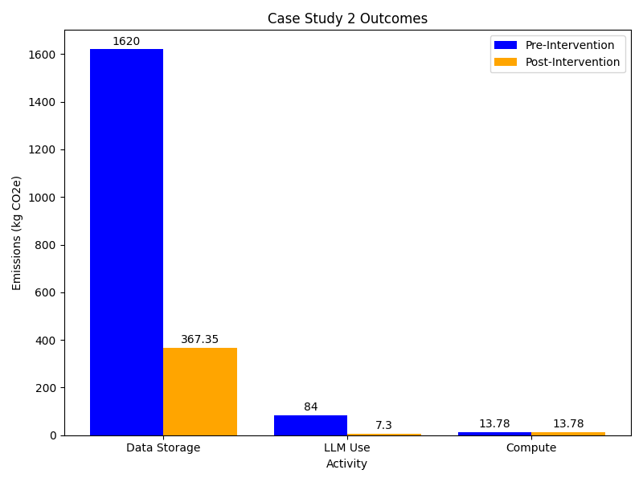

:::::::::::::::::::::::::::::::::::::: questions

- What are the main carbon emission sources for a researcher conducting computational
  data analysis?
- How do data storage choices impact long-term carbon emissions in research projects?
- What are the trade-offs between using different LLM models for generating research
  code?
- How can hybrid storage strategies reduce carbon emissions while maintaining data
  accessibility?

::::::::::::::::::::::::::::::::::::::::::::::::

::::::::::::::::::::::::::::::::::::: objectives

- Estimate carbon emissions from data storage, LLM usage, and computational processing
  using appropriate methodologies.
- Compare the carbon footprint of different storage technologies and LLM models.
- Evaluate the relative contribution of different activities to total research emissions
  and identify priorities for intervention.
- Design and implement emission reduction strategies including different storage
strategies and appropriate LLM selection.

::::::::::::::::::::::::::::::::::::::::::::::::

## Scenario

{alt="A large banner
comprising multiple scenes of Emma working in a research lab with pictoral
representations of data storage formats, DNA and data analysis."}

Emma is aware that storing and processing large amounts of data generates a significant
amount of carbon emissions. In order to reduce her research carbon footprint she
wants to calculate the total emissions associated with her workflow and
identify ways to reduce these emissions.

## Collecting Information

::::::::::::::::::::::::::::::::::::: challenge

### Data exploration (20 minutes)

Emma wants to learn more about each of the emission sources, focusing on
the following areas of her digital work:

1. Storing large amounts of scientific data
1. Use of LLMs (online)
1. Running data processing and analysis scripts

For each of these areas, how could Emma estimate or measure the associated emissions?
What data would she need to collect in each case?

:::::::::::::::: hint

- Consider the different types of data storage and which ones are more suitable
for Emma's data.
- Think about Emma's potential data management plan. What would be a relistic data
management flow that Emma could adopt.

:::::::::::::::::::::

::::::::::::::::::::::::::::::: solution

### Solution

### Data Storage

- Emma should first review her data management plan. How long is she going to keep
the data for, how many copies and how much data would she need for active analysis.
- If Emma has particular storage devices in mind, she could look for PCF
reports to get the embodied emissions and possibly a usage estimate. Such data is
less readily available for storage devices, however. In the absence of PCF data, Emma
could use some of the emissions estimates from sources such as those covered in
episode 3. She will need to know the volume of data and the amount of time she'll
need to store it for.

### Use of LLMs

- She could track which model she uses, and how many queries she sends, and the
  approximate size of the replies for use with the Hugging Face Ecologits calculator.

### Data Processing and analysis

- Looking for a PCF data sheet for her laptop will provide information
about the embedded emissions. For the operational emissions she could choose between
direct measurement with a power meter, use of a tool like codecarbon or estimation
with the Green Algorithms Calculator. I**In the known context that operational emissions
of laptops are low, it's probably easiest to use the lowest effort method of the
Green Algorithms calculator**. She can always follow up with a more accurate method
later, if the initial estimate seems significant. To do this, she'll need an estimate
of the CPU utilisation of her laptop and its specifications.

::::::::::::::::::::::::::::::::::::::::

:::::::::::::::::::::::::::::::::::::::::::::::

## Analysis

::::::::::::::::::::::::::::::: challenge

## Estimating Emissions (20 minutes)

Using the information below about Emma's current workflow calculate an estimate
of the carbon emissions associated with the Emma's digital research activities.

### Data Storage

- Her research will generate approx 3.5 Tb of raw data for the duration of
  the project (5 years), which she will be storing on different HDDs.
- There will also be additional 400 GB of processed data per year that she will work with
 regularly. This adds up to 2 TB over the duration of the project.
- The data must be retained for 10 years after the end of the project, meaning that
the data must be stored for a total of 15 years.
- Given that the lifespan of HDDs can reach 10 years in best case scenario, Emma will
have to replace the HDDs at least once.

**Use this [table](03_activities.md#measuring-and-estimating-data-storage-emissions) to estimate the emissions for
storing her data.**

### Use of LLMs

- Emma primarily interacts with an LLM via a browser chat window. She hasn't paid much
attention until now about which model she is using or how much she uses it. Checking
now, the default model is GPT-5.4. She also keeps track of her usage during a session
and finds that she sends 30 queries.
- Emma can't find the estimates for the GPT-5.4 model so she uses the generic GPT-5 model
estimate. She uses 30 as the number of queries but is not sure of the number of tokens
that have been returned. She decides to use the largest response size (15000 tokens)
with the understanding that this is an overestimate.

**Use HuggingFace's [Ecologits
calculator](https://huggingface.co/spaces/genai-impact/ecologits-calculator) tool to
estimate the emissions associated with Emma's use of LLMs.**

### Running scripts

- Emma is using her modern laptop and looks up the specifications for her model to get
more accurate emissions. She finds that her laptop has a Core i5-1145G7 processor, with
4 CPU cores and 64 GB memory. Her analysis scripts are not parallelised so can only use
up to 1 core. As she often leaves her scripts running overnight, she's not sure exactly
how long they take. For the next run she does she adds a command to record the total
runtime which is 6 hours.

**Use the [Green-algorithms calculator](https://calculator.green-algorithms.org/)
with her CPU model running for 6 hours with 1 core to estimate the emissions emitted by
Emma's laptop**

:::::::::::::::: hint

- Hints come here

:::::::::::::::::::::

::::::::::::::::::::::: solution

The estimated emissions associated with Emma's workflow are as follows:

### Data Storage

$$
E_{HDDs} = E_{embodied}+ E_{operational} \\
E_{HDDs} = (3 kgCO₂e/TB \times 9 TB + 9 kgCO₂e/TB \times 9 TB) \times 15   \\
E_{HDDs} = 1,620 kgCO₂e
$$

Storing the 9 TB data on HDDs will have associated carbon emissions
approximately equal to **1,620 kgCO₂e** in combined embodied and operational emissions,
based on the average values within the emissions ranges she identified in this [table](03_activities.md#measuring-and-estimating-data-storage-emissions).

### LLMs usage

Using HuggingFace's [Ecologits
calculator](https://huggingface.co/spaces/genai-impact/ecologits-calculator) tool and the
GPT-5 model estimate gives a emissions of 10.8 gCO2e per query and running 30 queries
generates **0.324 kgCO₂e**. Assuming an average of 1 session (30 queries) per week
over the 5 year course of the project that gives a total of **84 kgCO₂e**.

Note that this estimate doesn't include emissions from model training.

### Running scripts

Using the [Green-algorithms calculator](https://calculator.green-algorithms.org/) with
her CPU model running for 6 hours with 1 core to find that the emissions emitted by her
laptop - 53.20 gCO₂e each time. If she runs the similar analyses weekly over the 5 year
course of the project, the total emissions would be **13.78 kgCo2e**.

:::::::::::::::::::::::

:::::::::::::::::::::::::::::::

## Taking Action

Based on the calculations above, storing research data and using LLM's are the
activities with the largest associated carbon emissions. At around 1,700 kgCO2e, these
activities account to a quarter of the emissions per-capita in the UK,according to the
[International Energy
Association](https://www.iea.org/countries/united-kingdom/emissions). While lower in
comparison, the emissions linked to using LLMs to help write her code are not
insignificant and are equivalent to charging a smartphone [nearly 7000
times](https://www.epa.gov/energy/greenhouse-gas-equivalencies-calculator#results). With
this in mind, Emma wants to develop an improved research workflow to reduce her digital
carbon footprint.

::::::::::::::::::::::::::: discussion

## Measures to reduce emissions (20 minutes)

Emma identifies several ways in which she can improve her data storage and LLM usage.
In your groups discuss any other measures you think could be implemented and what impact
they might have.

### Data Storage Changes

- Emma has heard that her institution provides a tape-based cold storage options located
in two different campuses and which are intended for data that is not accessed very often.
She decides to keep the two copies of the raw data on the LTO-tape based storage
provided by her institution, with each copy being stored at a different site. This
ensures the data is safe in case something happens with one of the storages. She decides
to keep her processed data on HDDs, as she needs easy and fast access for analyses.
- Given that magnetic tape has negligible emissions when idle, we can assume that the
total emissions from storing data on tape come from embodied emissions, estimated at
~0.07 kgCO₂e per TB. Keeping the two copies of raw data (7 TB) in the institution’s
  LTO‑tape storage facilities would therefore generate 7.35 kgCO₂, while keeping the 2 GB
   of processed data on HDDs would generate 360 kgCO₂. Therefore, the total costs
  associated with storing Emma's research data would be **367.35 kgCO₂e**.

### Simpler LLM Model

- Emma is planning to switch from a reasoning model to a smaller LLM model,
GPT4-0-mini, for which emissions are estimated to be around 562 mgCO₂e per query.
- The total emissions associated with using the simpler LLM would be approx. **7.3 kgCO₂e**.

::::::::::::::::::::::::::::::::::::::

## Outcomes

A comparison of the emissions associated with Emma's current workflow and the improved one
can be found below:

<!-- markdownlint-disable-next-line line-length -->
{alt='A bar chart comparing the emissions from data storage, LLM usage and data processing before and after implementation of emissions reduction measures'}

Adopting the improved workflow would result in a five-fold reduction in Emma’s digital
carbon emissions. Particularly, moving from storing data on HDDs to a hybrid storage
approach that includes both HDDs and LTO-tapes has the greatest impact on lowering
emissions, saving around 1,250 kgCO2e, which is equivalent to the total annual
electricity-related emissions of three average UK households.

::::::::::::::::::::::::::::::::::::: keypoints

- Storing large amounts of research data can have significant environmental impacts.
- Having a good data management plan and using appropriate storage medium can reduce
the carbon emissions associated with storing data.
- Not all tasks require the most advanced LLM model. Switching from a reasoning model
 to a less powerful model for simple data processing and analysis scripts can also contribute
 to lowering carbon emission associated with digital research.
- While Emma's improvements are substantial, they represent only one piece of a larger
puzzle. For a life scientist, the total work-related emissions typically range from 4 to
15 tCO2e annually ^2^. These numbers are driven by carbon intensive activities, such as
international travel, laboratory heating, ventilation and AC systems, and the heavy use
of chemical reagents and single-use equipment.

::::::::::::::::::::::::::::::::::::::::::::::::

## References

1. [Winter N,The paradox of the life sciences: How to address climate change in the lab: How to address climate change in the la. doi: 10.15252/embr.202256683](https://pmc.ncbi.nlm.nih.gov/articles/PMC9986813/)
2. [Woo, N.H. A comparative study of AI and human programming on environmental
 sustainability. Sci Rep 15, 39182 (2025). https://doi.org/10.1038/s41598-025-24658-5](https://www.nature.com/articles/s41598-025-24658-5)
